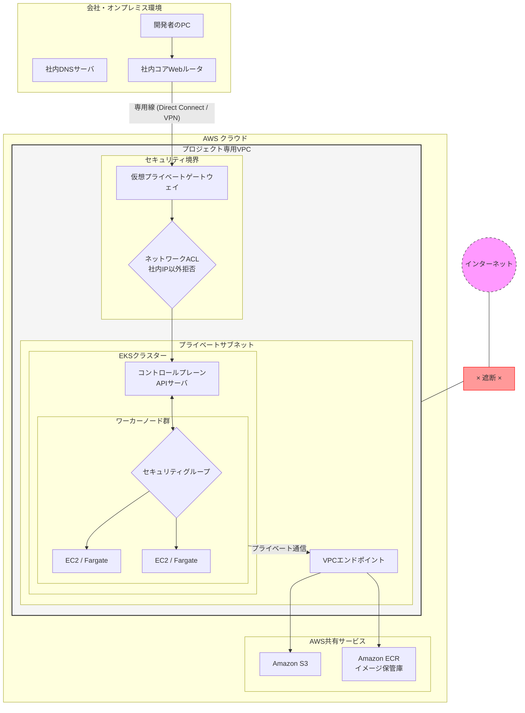
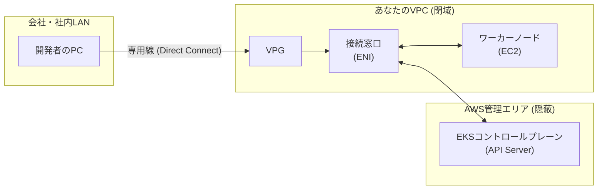
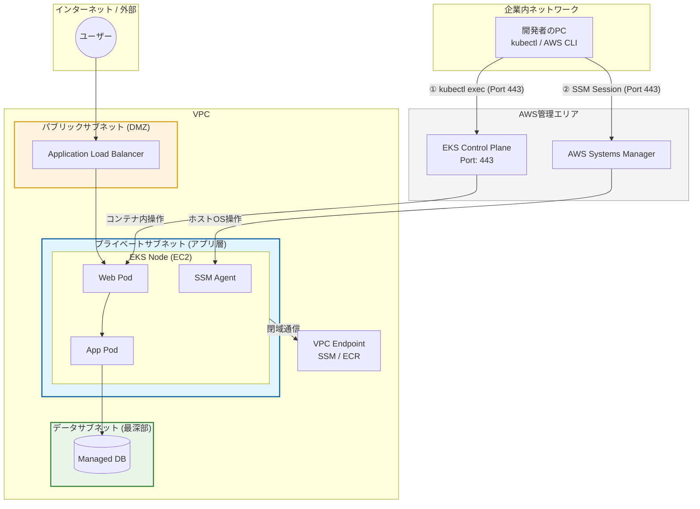
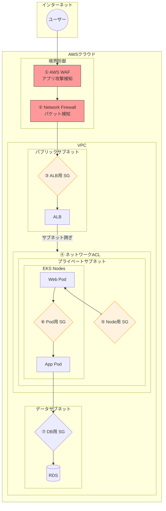
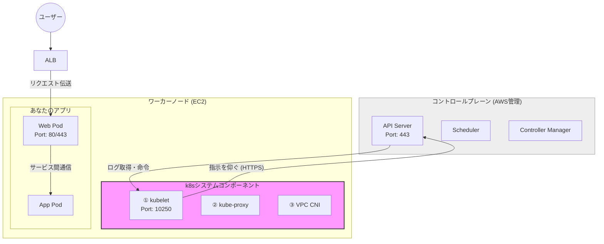
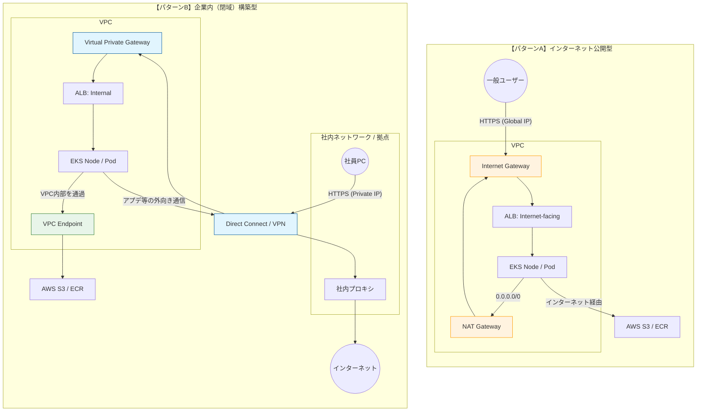
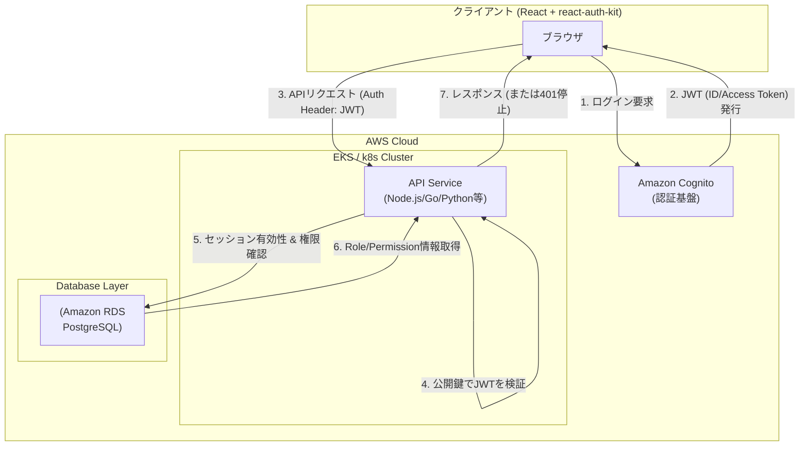
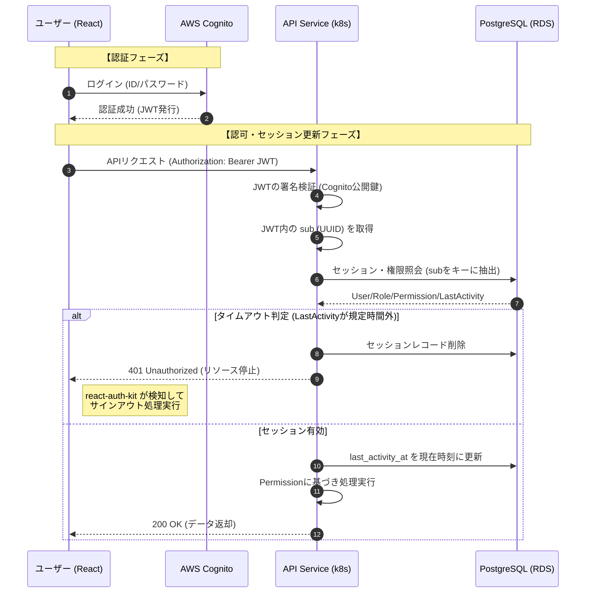

# 「社内LAN」から「専用線」を通って「AWSの閉域ネットワーク」へ繋がる流れ

### この構成図の重要ポイント

1. **「インターネット」との断絶**:
右側にある「インターネット」とは完全に切り離されており、赤い「×」の部分で通信が遮断されています。
2. **専用線という「廊下」**:
会社のルータからAWSのVPG（Virtual Private Gateway）までが一本の太い廊下でつながっており、外部からはこの中の通信を見ることができません。
3. **多層防御のフィルター**:
* **NACL**: VPCの入り口で、会社以外のIPアドレスをすべて弾きます。
* **SG（セキュリティグループ）**: ノードの直前で、Kubernetesに必要な通信（443番ポートなど）以外を弾きます。


4. **VPCエンドポイントの役割**:
コンテナイメージを取得する（ECR）際や、ファイルを保存する（S3）際も、一度もインターネットに出ることなく、VPC内部の隠し通路を通って通信します。

---
<br/>
<br/>
<br/>

# 企業のEKS通信イメージ

### 結論

* **コントロールプレーン（脳みそ）**: AWSの管理区画にあり、ユーザーからは中身が見えません。
* **アクセス方法**: ユーザーのVPC内に「内線電話（ENI）」が設置され、そこを経由して通信するため、**インターネットには一切出ません。**
---
<br/>
<br/>
<br/>

# エンドポイントについて
## 1. 「脳みそ（コントローラー）」と「体（ノード）」をつなぐルート

これは、あなたが手動で「Endpointリソース」を作る必要はありません。EKSを作成する際の設定によって自動的に裏側で構成されます。

* **仕組み:** AWSが「あなたのVPC」の中に、コントロールプレーンへ直通する**ENI（仮想ネットワークカード）**を差し込みます。
* **役割:** ワーカーノード上の `kubelet` というエージェントが、このENI経由で「次は何の仕事をすればいい？」とコントローラーに聞きに行きます。
* **企業の設定:** ここで **「Endpoint Private Access」** を有効にします。これにより、この通信がVPC内部だけで完結し、インターネットへ漏れ出ることがなくなります。

---

## 2. 「ノード」と「他のAWSサービス」をつなぐルート（VPC Endpoint）

こちらは、企業インフラ担当者が意図的に作成・配置する「Endpoint」です。

* **仕組み:** **VPC Endpoint (Interface型/Gateway型)** をVPC内に作成します。
* **役割:** ワーカーノードが、コンテナイメージを取得するために **ECR** にアクセスしたり、ログを保存するために **CloudWatch** にアクセスしたりする際の「専用窓口」になります。
* **なぜ必要か:** ECRやS3は、本来VPCの外（パブリックな場所）にあるサービスです。インターネット出口を塞いだ企業VPCでは、これらへの「専用通路（Endpoint）」を作ってあげないと、ノードはコンテナを起動することすらできません。

---

## 2種類の「つながり」を整理

| つなぐ対象 | 手段 (技術名) | 誰が用意する？ | 企業での呼び方 |
| --- | --- | --- | --- |
| **コントローラー ↔ ノード** | **EKS Private Endpoint** (ENI経由) | AWSが自動作成 (設定で有効化) | EKSのプライベート接続 |
| **ノード ↔ AWSサービス** | **VPC Endpoint** (PrivateLink) | ユーザー(インフラ担当)が作成 | サービス通信の閉域化 |

---

## 結論：企業内での実態

企業内のEKS環境では、**「2種類のEndpoint」が組み合わさって、完全な閉域網**を作っています。

1. **EKSのEndpoint** を使って、管理通信を社内LAN・VPC内に閉じ込める。
2. **VPC Endpoint** を使って、周辺サービスとの通信をVPC内に閉じ込める。

---
<br/>
<br/>
<br/>

# AWS EKSクラスタ構築手順

### 1. 構築前の「事前申請」フェーズ

CLIを叩く前に、まず紙やExcelの申請書が飛び交います。

* **VPC割当申請**: 「プロジェクトAで、IPアドレスを10.1.2.0/24の範囲で使いたい」とインフラ部に申請し、許可された値を手順書に書き込みます。
* **KMSキー作成依頼**: セキュリティ担当者に「暗号化キーを1つ作ってください」と頼み、発行された `Key ARN` を控えます。

### 2. CLIによる「一歩ずつ」の構築フェーズ

IaCがあれば一瞬ですが、手動の場合は「前のコマンドの結果を見てから次を叩く」という作業になります。

1. **VPCとサブネットの作成**
`aws ec2 create-vpc` でVPCを作り、返ってきたIDを使ってサブネットを一つずつ作ります。
2. **専用線との紐付け（ルーティング設定）**
`aws ec2 create-route` を叩き、社内ネットワーク（Gateway）への道を「手書き」で設定します。
3. **KMSキーのポリシー設定**
`aws kms put-key-policy` で、作成したEKSがそのキーを使えるように権限を付与します。
4. **EKSクラスターの作成**
ここでようやく `aws eks create-cluster` を実行します。この際、先ほど控えた「サブネットID」「セキュリティグループID」「KMSのARN」をすべて引数に手入力します。

---

### 3. 「エビデンス」が最も重要

こうした現場でCLIを叩く際、最も時間がかかるのは**「証拠残し」**です。

* **ログの保存**: 全てのコマンドの実行結果をテキストファイルに保存します（後で監査に見せるため）。
* **スクリーンショット**: AWSコンソールの設定画面を「手順書通りに設定されているか」証明するためにキャプチャを撮り、Excelに貼り付けます。

---
<br/>
<br/>
<br/>

# EKSでのネットワーク構成
一般的なEKS（AWS推奨構成）における「VPCサブネットの役割分担」と、SSHを使わずに「443番ポート（API通信）」だけでデバッグする流れを一つの図にまとめました。



### 図の解説ポイント

1. **サブネットの3層構造**:
* **パブリック**: 窓口となる `ALB` だけを配置。
* **プライベート**: 本体の `EKS Node` を配置。インターネットから直接は入れません。
* **データ**: `DB` をさらに奥へ隔離。


2. **デバッグの経路 (SSHポート22は不要)**:
* **① `kubectl exec**`: 開発者のPCからAWS管理下の「APIサーバー（443番）」へ命令を送り、そこを経由してコンテナの中身を操作します。
* **② `SSM Session Manager**`: 開発者のPCから `Systems Manager` サービス経由で、ノード内の `SSM Agent` と通信します。これも「外向きの443番」を利用するため、インバウンドの22番を開ける必要がありません。


3. **VPCエンドポイント (VPCE)**:
* プライベートサブネット内のノードが、SSMやECR（コンテナ保管庫）と通信する際も、インターネットを通らずVPC内部の専用路を通ります。
---
<br/>
<br/>
<br/>


# セキュリティ構成

---
<br/>
<br/>
<br/>

# セキュリティ設定の導入のタイミングと優先度
### 1. 【必須：最優先】初期設定で必ずやるもの

これがないと、そもそもインフラとして「全裸」に近い状態です。

* **Security Group (SG)**
* **タイミング:** EKSクラスターやALBを作成する**その瞬間**。
* **理由:** AWSリソースを作成する際に必ず指定が必要だからです。
* **設定:** 「ALBは443番だけ開ける」「ノードはALBからの通信だけ受ける」という**最小権限のルール**を最初にバッチリ固めます。


* **Network ACL (NACL)**
* **タイミング:** サブネット（VPC）作成時。
* **理由:** デフォルトでは「全許可」になっていますが、企業では「自社IP以外からのアクセスをサブネットレベルで拒否する」といった**大枠のガードレール**として初期に設定します。


---

### 2. 【推奨：次にやる】公開直前に設定するもの

外部にサービスをさらす前に導入を検討します。

* **AWS WAF**
* **タイミング:** ALBが完成し、アプリが動き始めた後。
* **理由:** アプリケーション層（SQLインジェクションなど）の防御なので、アプリの中身が見えてから調整します。
* **設定:** 最初は「検知のみ（Countモード）」で動かし、正常な通信を遮断しないか確認してから「ブロック」に切り替えます。


---

### 3. 【オプション：必要に応じて】後から追加するもの

コストが高く、設定も複雑なため、最初から入れないプロジェクトも多いです。

* **AWS Network Firewall**
* **タイミング:** セキュリティ要件が非常に厳しい場合、または運用が落ち着いた後。
* **理由:** **非常に高価**（月額数十万円〜）であり、ネットワーク経路（ルーティング）を大幅に書き換える必要があるため、初期導入の難易度が高いです。
* **設定:** 「VPCから外への全通信を検査する」といった、VPCの出口・入口に後から「検問所」として差し込みます。


---

## 初期設定時の「現実的な構成」フロー

1. **VPC作成時**: **Network ACL** でサブネットの境界を引く。
2. **EKS構築時**: **Security Group** をガチガチに設定して「内線」をつなぐ。
3. **ALB作成時**: **WAF** を紐付けて、外からの攻撃に備える。
4. **運用開始後**: 監査やさらなる強化が必要なら **Network Firewall** を検討。

---
<br/>
<br/>
<br/>

# セキュリティ設定例
## 1. AWS WAF（最外口：アプリ層の検問）

ALBに紐付けて、HTTPリクエストの中身（SQLインジェクションなど）を検査します。

* **設定例:** AWSが提供する「マネージドルール」を適用するのが一般的です。
* **Core rule set (CRS):** 一般的な脆弱性攻撃をブロック。
* **SQL database:** SQLインジェクション攻撃をブロック。
* **Amazon IP reputation list:** 悪名高いIP（ボットや攻撃元）をブロック。


* **ポイント:** 最初は **"Allow all"** にした上で、攻撃を **"Count"（記録のみ）** して、正常なユーザーを誤ブロックしないか確認してから運用を開始します。

---

## 2. Security Group (SG)（メインの壁：ポートの制御）

これが最も重要です。**「SG間の参照」**を使って、数値を直接書かないのがコツです。

### ① ALB用 SG

* **インバウンド:** `0.0.0.0/0`（全インターネット）から `443(HTTPS)` のみ許可。
* **アウトバウンド:** **「EKSノード用 SG」**への通信のみ許可。

### ② EKSノード用 SG

* **インバウンド:** **「ALB用 SG」**からの `80` またはターゲットポートのみ許可。
* **アウトバウンド:** `0.0.0.0/0`（OSアップデートやコンテナ取得のため）。

> **なぜSG間で指定するのか？**
> ALBのIPアドレスがAWS側で変わっても、SG同士が「友達」として紐付いていれば、通信は途切れません。

---

## 3. Network ACL (NACL)（サブネットの境界：IPのガードレール）

サブネットへの出入り口を一括で制限します。

* **設定例:**
* **パブリックサブネット用:** 80/443番ポート以外の**「怪しいポート（例：22, 3389など）」**を、インターネット（0.0.0.0/0）に対して明示的に `DENY`（拒否）します。
* **プライベートサブネット用:** インターネットからの直接通信をすべて `DENY` し、VPC内部（10.x.x.x）からの通信のみを許可します。


---

## 4. AWS Network Firewall（オプション：高度なパケット検査）

VPCの出入り口に設置し、ドメイン名ベースでフィルタリングします。

* **設定例:**
* **許可リスト方式:** 「コンテナのアップデート先（`*.amazonaws.com` や `github.com`）への通信だけを許可し、それ以外の見知らぬ海外サーバーへの通信はすべて遮断する」といった、マルウェアの「踏み台」化を防ぐ設定をします。


---

## 設定例のまとめ（通信の流れ）

| レイヤー | 検査内容 | 具体的な設定イメージ |
| --- | --- | --- |
| **WAF** | リクエスト内容 | `SELECT * FROM...` などの不審な文字列を弾く |
| **ALB SG** | 通信経路 | 「外からの443番だけ通す」 |
| **Network ACL** | IP/ポートの大枠 | 「サブネット内に怪しいIPを入れない」 |
| **Node SG** | 通信の送り主 | 「ALBという身内からの通信だけ通す」 |

---
<br/>
<br/>
<br/>

# EKSを構成するプログラムの通信について
結論から言うと、**「設定はAWSが自動でやってくれるので、日常的にポート番号を覚える必要はないが、セキュリティグループ（SG）の設計時だけは強烈に意識する必要がある」**となります。

## 1. 誰が何番で話しているのか？（主要なポート）

これらが通信できないと、クラスターは一瞬で崩壊します。

| 送信元 | 送信先 | ポート番号 | 内容 |
| --- | --- | --- | --- |
| **ノード (kubelet)** | **マスター (API Server)** | **443** | 「次は何をすればいい？」という指示を仰ぐ |
| **マスター (API Server)** | **ノード (kubelet)** | **10250** | マスターからノードへ「ログを見せて」等の命令 |
| **ノード間** | **ノード間** | **1025-65535** | Pod同士の通信や、ヘルスチェック |

---

## 2. なぜユーザーは「普段は」気にしなくていいのか？

EKSには **「クラスターセキュリティグループ」** という仕組みがあるからです。

* **自動作成**: EKSクラスターを作ると、AWSが「このポートは開けておかないとk8sが壊れるぞ」というルールを盛り込んだSGを自動的に作ってくれます。
* **自動割当**: あなたが「マネージド型ノードグループ」でノードを増やすと、そのノードには自動的にこの「お守り」のようなSGが適用されます。
* **結果**: 「内部的なお喋り（443番や10250番）」は、最初から「通る」ように設定されているのです。

---

## 3. 「気にしなきゃいけない」落とし穴

「自動だから安心」と思っていると、以下のようなケースで**通信が遮断され、EKSが壊れます。**

### ① 自分で「ノード用SG」を追加で作ったとき

企業ルールで「独自のSG」を上書きしたり、追加したりする場合です。
うっかり「443番（アウトバウンド）」や「10250番（インバウンド）」を許可し忘れると、マスターからノードが**「NotReady（行方不明）」**になり、アプリが全停止します。

### ② メトリクスを取得したいとき

「PodのCPU使用率を監視したい（Metrics Server）」という場合、マスターがノードの **10250番** にアクセスしに行きます。ここを独自SGで閉じてしまっていると、監視データが一切取れなくなります。

### ③ Webhook（受付検査）を使うとき

高度な設定（例：特定のルールに違反したPodの起動を拒否する）を導入すると、マスターから特定のPodに対して、特殊なポート（例：8443や9443）で通信が発生します。これもSGで開けておく必要があります。

---

## 4. ユーザーが守るべき「たった一つのルール」

複雑なポート番号を暗記する代わりに、AWS（EKS）の世界では以下の設計思想で動くのが「正解」です。

> **「EKSが自動で作ったSG」と「自分が作ったSG」を、お互いに『信頼（許可）』し合う設定にする。**

具体的には、自分のSGのインバウンドルールに、ポート番号ではなく **「EKSクラスターSGのID」を指定して「全部許可」** と書きます。こうすれば、裏方のプログラムが何番ポートを使おうが、身内同士の通信として自動で通るようになります。




---

## まとめ：ユーザーの関わり方

* **構築時**: AWSが作った「クラスターSG」を削除したり、中身を無理に消したりしない。
* **デバッグ時**: もしノードが「NotReady」になったら、真っ先に「裏方の通信ポートを自分で塞いでいないか」を疑う。
---
<br/>
<br/>
<br/>

# 企業内EKSとパブリックEKSの違い

企業内で構築する場合（閉域網）とインターネット上で公開する場合の最大の違いは、**「通信の出口（入口）をどこに設定するか」**と**「名前解決（DNS）をどうするか」**の2点に集約されます。

標準的な構成（EKS + EC2 + RDS + S3）を例に、設定の差を比較します。

---

## 1. ネットワーク構成の比較表

| 項目 | インターネット公開型 | 企業内（閉域）構築型 |
| --- | --- | --- |
| **ALBの属性** | インターネット向け (Internet-facing) | **内部向け (Internal)** |
| **デフォルトルート** | **Internet Gateway (IGW)** | **Virtual Private Gateway (VGW)** または Transit Gateway |
| **ノードのネット接続** | NAT Gateway経由で外へ | **専用線を通って社内プロキシ経由**で外へ |
| **AWSサービス接続** | パブリックエンドポイント経由 | **VPCエンドポイント (Interface型/Gateway型)** |
| **DNS (名前解決)** | Route 53 (Public Hosted Zone) | **Route 53 Resolver** (オンプレ連携) |

---

## 2. 具体的な設定値の違い

### ① ロードバランサー (ALB) の設定

EKSの `Service` または `Ingress` のマニフェスト（YAML）で指定するアノテーションが変わります。

* **インターネット型**:
```yaml
service.beta.kubernetes.io/aws-load-balancer-scheme: "internet-facing"

```


* **企業内（閉域）型**:
```yaml
service.beta.kubernetes.io/aws-load-balancer-scheme: "internal"

```


> これにより、ALBに「グローバルIP」が付くか「社内プライベートIP」が付くかが決まります。


### ② セキュリティグループ (SG) の許可対象

* **インターネット型**:
`0.0.0.0/0` からのポート443入力を許可します。
* **企業内（閉域）型**:
**社内拠点のIPアドレス帯（例：10.0.0.0/8）** からの入力のみを許可します。

---

## 3. 外部サービス（S3/ECR/SSM）へのアクセス方法

インターネットがない企業内環境では、AWSのサービス（S3やECRなど）にアクセスするのにも工夫が必要です。

* **インターネット型**:
特に意識せずとも、NAT Gateway経由でAWSの公開窓口へアクセスできます。
* **企業内（閉域）型**:
**VPCエンドポイント**を作成します。
* **S3/DynamoDB**: Gateway型エンドポイント（無料）をルートテーブルに追加。
* **ECR/SSM/EKS API**: Interface型エンドポイント（有料/PrivateLink）を各サブネット内に作成。


> これを忘れると、EKSノードが「コンテナイメージをダウンロードできない（ImagePullBackOff）」、あるいは「SSMでログインできない」という事態になります。


---

## 4. ルートテーブル (Route Table) の書き換え

通信の「行き先」を決定する最重要設定です。

* **インターネット型**:
`0.0.0.0/0` → **`igw-xxxx` (Internet Gateway)**
* **企業内（閉域）型**:
`0.0.0.0/0` → **`vgw-xxxx` (Virtual Private Gateway)**
> もしくは、特定の社内ネットワーク宛（例：172.16.0.0/12）だけをVGWへ向け、外への通信は一切させない設定にします。




### 主な設定・構造の違いの解説

#### ① 入口（ALB）の違い

* **インターネット型:** ALBに「グローバルIP」を付与します。DNS（Route 53）には世界中から引ける名前を登録します。
* **企業内（閉域）型:** ALBに「プライベートIP」を付与します。社外からは名前解決すらできないようにし、社内ネットワークからのみアクセス可能にします。

#### ② 出口（インターネットへの道）の違い

* **インターネット型:** `NAT Gateway` を通ってそのままインターネットへ出ます。非常にシンプルです。
* **企業内（閉域）型:** そもそもVPC内にインターネットへの出口（IGW）を作りません。OSのアップデートなどが必要な場合は、専用線を通って「社内のプロキシサーバー」を経由して外に出るようにルーティングを組みます。

#### ③ AWSサービス（S3/ECR等）への繋ぎ方の違い

* **インターネット型:** 標準のAWSのエンドポイント（インターネット上の窓口）にそのまま繋ぎます。
* **企業内（閉域）型:** 物理的なネットがないため、VPCの中に**「VPCエンドポイント」**という専用の入り口を作ります。これを作らないと、EKSはコンテナイメージ（ECR）すら取得できず、起動に失敗します。

---

### まとめ：設定時のマインドセットの差

* **インターネット型**を作るときは、**「いかに不要なポートを閉じて守るか（Security Group）」**が焦点になります。
* **企業内（閉域）型**を作るときは、**「いかに必要な通信を通すための道を作るか（Routing / VPC Endpoint）」**が最大の苦労ポイントになります。

---

## まとめ：企業内構築の「落とし穴」

企業内構築（閉域）を進める場合、以下の**「3つの疎通確認」**が最大の山場になります。

1. **VPCエンドポイントの作成漏れ**: インターネットがないため、AWSのAPIすら叩けない。
2. **DNSフォワーダーの設定**: 社内PCから `myapp.internal` と叩いたとき、AWS上のALBのIPを引けるようにする設定。
3. **プロキシ設定**: コンテナ内でOSのアップデートをする際、社内プロキシを指定しないと外に出られない。

---
<br/>
<br/>
<br/>

# ユーザ管理のAWS Cognitoへの移行

これまでの議論を踏まえ、**「既存の複雑なRole/Permission構造」**と**「タイムアウトによる厳格なリソース停止」**を両立させるための推奨構成をまとめます。

この構成の肝は、**「認証（ID確認）はCognito」「認可（権限チェック）とセッション状態（タイムアウト）はPostgreSQL」**という役割分担にあります。

---

### 1. 推奨構成のポイント

* **ID管理:** AWS Cognito（Managed Service）でセキュアに管理。
* **認可ロジック:** 既存の `User -> Role -> Permission` テーブルをRDS(PostgreSQL)で維持。
* **セッション制御:** JWTの有効期限とは別に、DB上の `sessions` テーブルで「無操作タイムアウト」を厳格に管理。
* **フロントエンド:** `react-auth-kit` を使い、サーバーからの401エラー（タイムアウト等）を検知して即座にログアウト処理を実行。

---

### 2. システム構成図 (Architecture Diagram)



---

### 3. シーケンス図 (Sequence Diagram)

「タイムアウトによるリソース停止」を含めたログインからリクエスト完了までの流れです。



---

### 4. まとめ：なぜこの構成か

1. **既存資産の保護:** `User -> Role -> Permission` の複雑なリレーションをCognitoの属性（String制限あり）に無理やり押し込める必要がありません。
2. **厳格な停止制御:** JWTは「発行後の無効化」が難しいですが、この構成ではリクエストごとにDB（またはRedis）のセッション状態を見るため、管理者がDB側でセッションを消せば、即座にそのユーザーのリソースアクセスを遮断できます。
3. **スケーラビリティ:** 認証（重い処理）はCognitoにオフロードし、アプリ側は軽量なDBクエリ（インデックスの効いたセッション引き当て）だけで済むため、k8sのオートスケーリングとも相性が良いです。

この設計であれば、`react-auth-kit` の既存ロジックを大きく変えず、セキュアで管理しやすいAWS環境へ移行可能です。

---
<br/>
<br/>
<br/>

# AWSでのドメイン取得からALB利用まで

AWSでの「ドメイン取得」から「KubernetesでのALB利用（Ingress）」までの流れを、一つのストーリーとしてまとめました。

---

## 🌐 AWSで独自ドメインのWebサービスを公開するまでの全体像

大きな流れは、**「ドメインの準備」→「証明書の用意」→「インフラ（ALB/EKS）との紐付け」**の3ステップです。

### 1. ドメインの管理（Route 53）

まず、インターネット上の住所である「ドメイン」を手に入れます。

* **ドメイン取得:** Route 53などで `example.com` を購入。
* **ホストゾーン:** Route 53内に管理台帳を作成。
* **ワイルドカード:** `*.example.com` というレコードを作ることで、どんなサブドメイン（`app1.example.com` など）へのアクセスも受け入れ可能にします。

### 2. 安全な通信の準備（ACM）

ブラウザで「保護された通信（HTTPS）」にするための証明書を用意します。

* **AWS Certificate Manager (ACM):** ここで `*.example.com` の証明書を発行します。
* **検証:** Route 53に特定のレコードを書き込むことで「私がこのドメインの所有者です」と証明します。

### 3. Kubernetesとの連携（Ingress / ALB）

ここで登場するのが **AWS Load Balancer Controller** です。

1. **Ingressリソースの作成:** Kubernetes上で「このドメインでアクセスさせたい」という設定（YAML）を書きます。
2. **ALBの自動生成:** コントローラーがその設定を読み取り、AWS上に**ALB（Application Load Balancer）**を自動で作成します。
3. **エイリアス接続:** ALBが完成すると専用の「DNS名」が払い出されます。これをRoute 53のレコード（Aレコード/エイリアス）に紐付けます。
4. **通信開始:** ユーザーが `app1.example.com` にアクセスすると、Route 53がALBへ誘導し、ALBが適切なPod（コンテナ）へ通信を運びます。

---

### 💡 この構成のメリット

* **IPアドレスを気にしなくていい:** ALBのIPが変わっても、Route 53（エイリアス）とIngressが自動で連携してくれます。
* **運用の自動化:** KubernetesのYAMLを更新するだけで、AWS側のロードバランサーの設定も自動で変わります。
* **コストと管理の集約:** ワイルドカードを使えば、1つのALBと1つの証明書で、大量のサブドメインサービスを運用できます。

---

