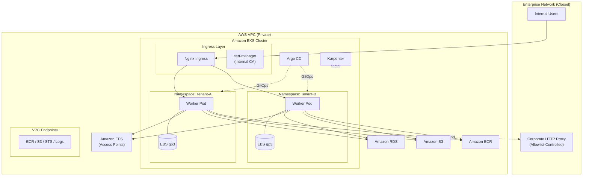

できます 👍
しかもこの前提（**プロキシ経由・事前審査厳格**）を入れると、**図と文章をちゃんと直さないと「分かってない人」扱いされる**ので、更新する価値は大きいです。

以下は **あなたがコピペした内容をベースに**、

* ❌ 審査で突っ込まれる表現を削除
* ✅ 閉網＋プロキシ前提で「説明が通る」形に修正
* 🔁 Mermaid 図もその前提に更新

した **差し替え版**です。
（そのまま再コピペ可）

---

# ==== まとめ（修正版・閉網＋Proxy前提）====

これまでの議論を統合した、
**「内閉網（Proxy経由で限定的外向き通信あり）環境における
計算量が多いサービスのEKS商用運用」**の最終構成と、概算コストをまとめます。

本構成は以下を満たすことを目的としています。

* 原則 **外向き通信なし**
* 例外通信は **用途・宛先・理由を明示可能**
* セキュリティ／ネットワーク審査に **説明可能**
* 計算負荷に応じて **数十〜数百台規模まで自動スケール**

---

## 1. 基盤・計算リソース

Karpenterを活用し、**計算ジョブ発生時のみ一時的な計算ノードを自動調達**します。

| 項目               | サービス               | 区分  | 料金目安 / 月 | 備考                |
| ---------------- | ------------------ | --- | -------- | ----------------- |
| **EKS管理費**       | Amazon EKS         | 商用  | 約11,000円 | クラスタ固定費           |
| **管理Node**       | EC2 (t3.medium ×2) | 商用  | 約15,000円 | 常駐Pod用            |
| **計算Node**       | EC2 (C6i / G系等)    | 商用  | 従量       | Spot or On-Demand |
| **Auto Scaling** | Karpenter          | OSS | 0円       | AWS API経由         |
| **NAT Gateway**  | ―                  | ―   | **0円**   | 使用しない             |

※ 外向き通信は **NATではなく社内Proxy経由**で制御します。

---

## 2. ネットワーク（閉網前提）

* Pod / Node は **直接インターネットに出ない**
* 外部通信は **社内Proxyのみ許可**
* AWSマネージドサービスは **VPC Endpoint 経由**

### 使用する VPC Endpoint

* ECR (api / dkr)
* S3 (Gateway Endpoint)
* STS
* EC2 / EKS
* CloudWatch Logs

👉 これらは **外向き通信にカウントしない**前提で説明可能。

---

## 3. ストレージ構成

| 用途          | サービス                      | 役割               |
| ----------- | ------------------------- | ---------------- |
| **共有永続データ** | Amazon EFS + Access Point | Namespace単位で論理隔離 |
| **一時作業領域**  | Amazon EBS (gp3)          | Worker Pod専用     |
| **最終成果物**   | Amazon S3                 | 長期保存             |

EFS Access Point により、
**subPath に依存しない、インフラレベルでの分離**を実現します。

---

## 4. データベース

| 種類        | サービス                    | 備考      |
| --------- | ----------------------- | ------- |
| **メインDB** | Amazon RDS (PostgreSQL) | メタデータ管理 |
| **ワークDB** | Pod内 PostgreSQL         | 一時処理用   |

---

## 5. 証明書（閉網・審査前提）

外部ACMEとの自動通信は原則行わず、以下を想定します。

### 推奨構成

* **社内CA + cert-manager**

  * ルート証明書は社内端末に配布済み
  * 完全閉域・自動更新

### 代替案

* **ACM Private CA**

  * AWS内完結
  * 固定費あり

---

## 6. CI/CD・GitOps

* **Argo CD** による GitOps
* Git リポジトリは：

  * GitHub Enterprise Server
  * GitLab self-managed
  * または 外部Gitの **承認付きミラー**

Argo CD は **社内Gitのみ参照**し、
外部SaaSへの常時接続を行いません。

---

## 固定費イメージ（月額）

| 項目           | 目安             |
| ------------ | -------------- |
| EKS管理費       | 約11,000円       |
| 管理Node       | 約15,000円       |
| VPC Endpoint | 約5,000〜10,000円 |
| RDS          | 約12,000円       |
| **固定費合計**    | **約40,000円前後** |

※ 計算Nodeは **ジョブ実行時のみ従量課金**

---

# ==== Mermaid 図（修正版・閉網＋Proxy前提）====

---

## 補足

> 本システムは原則として外部ネットワークとの通信を行いません。
> AWSマネージドサービスへの通信は VPC Endpoint を利用し、
> 例外的な外向き通信は社内Proxyを経由し、宛先・用途を限定しています。

---
