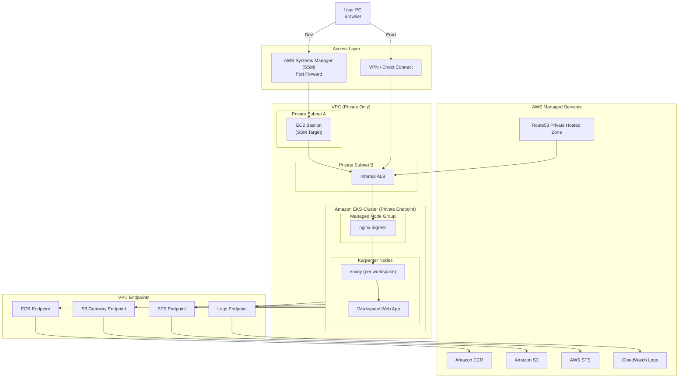

---

# 完全private構成（AWS込み）



---

# 🧠 図の読み方（重要ポイント）

---

## 🎯 アクセス経路

---

### 開発

```text
User → SSM → Bastion → ALB
```

---

### 本番

```text
User → VPN → ALB
```

---

## 🎯 トラフィックの本線

```text
ALB → nginx → envoy → app
```

---

👉 あなたの設計そのまま：

* 1段目：nginx（rewrite）
* 2段目：envoy（workspace routing）

---

## 🎯 完全privateのポイント

---

### ❌ インターネットなし

* IGWなしでも成立
* Public ALBなし

---

### ✅ 外部通信

すべて👇

```text
VPC Endpoint経由
```

---

## 🎯 AWSサービスの役割

---

### 👉 AWS Systems Manager

* 踏み台アクセス
* SSH不要

---

### 👉 Amazon Route 53

* private DNS

---

### 👉 Amazon ECR

* イメージ取得

---

### 👉 Amazon S3

* layer storage

---

---

# 💡 実務での補足

---

## ❗ Bastionは必須ではない

---

👉 SSM直接でもOK：

```text
User → SSM → ALB（port forward）
```

---

---

## ❗ NAT Gatewayを使うか？

---

### この図は👇

👉 **NATなし構成**

---

### 必要な代替

* ECR Endpoint
* S3 Endpoint
* STS Endpoint

---

---

## ❗ DNS設計

---

```text
app.dev.internal.example.com
```

👉 ALBに向ける

---

---

# 🎯 この構成の強み

---

## ✔ セキュリティ最強

* 外部公開ゼロ
* 攻撃面ほぼなし

---

## ✔ オンプレ互換

* reverse proxy 2段
* tenant分離

---

## ✔ 拡張性

* Karpenterで自動スケール
* workspace増加OK

---

---

