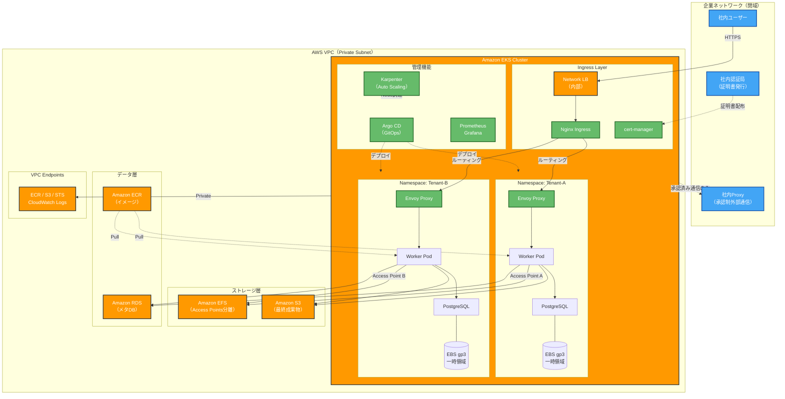
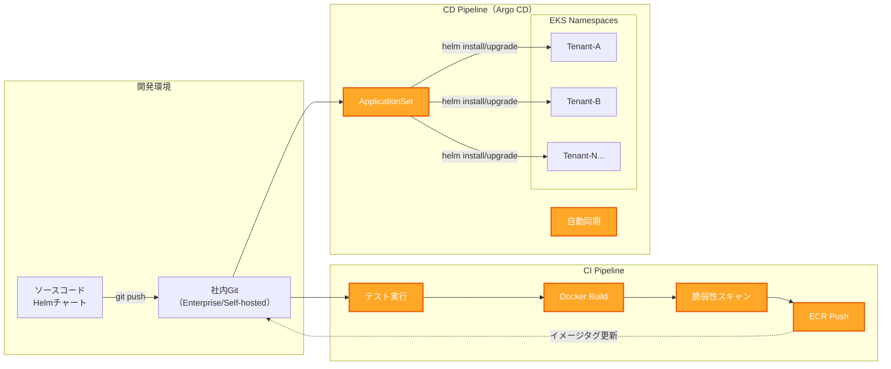

EKS商用インフラ構成＆コスト見積もり（2026年版）
## 内閉網環境でのマルチテナント計算基盤

**構成方針**
- 外向き通信は原則禁止（社内Proxy経由のみ）
- AWS APIはVPC Endpoint経由
- EFS Access Pointによる完全なテナント分離
- Karpenterによる計算リソースの動的確保

---

## 1. インフラ基盤

### 1-1. コンピュートリソース

| 項目 | サービス | 区分 | 月額目安 | 備考 |
|------|---------|------|---------|------|
| **EKS管理費** | Amazon EKS | 商用 | **約11,000円** | クラスタ固定費 ($73) |
| **管理Node** | EC2 t3.medium ×2 | 商用 | **約15,000円** | ArgoCD/Karpenter稼働用 |
| **計算Node** | EC2 C6i/G5等 | 商用 | **従量課金** | Spot活用で70-90%削減可 |
| **オートスケーリング** | Karpenter | OSS | **0円** | AWS API経由で制御 |

### 1-2. ネットワーク（閉網前提）

| 項目 | サービス | 月額目安 | 備考 |
|------|---------|---------|------|
| **VPC Endpoint** | AWS PrivateLink | **約8,000円〜** | ECR/S3/STS/Logs用 |
| **NAT Gateway** | - | **0円** | 使用しない |
| **外部通信** | 社内Proxy | **0円** | 限定的な承認制 |

**使用するVPC Endpoint**
- ECR (ecr.api / ecr.dkr)
- S3 (Gateway型)
- STS, EC2, EKS
- CloudWatch Logs

---

## 2. ストレージ構成（適材適所の3層）

| 用途 | サービス | 月額目安 | 特徴 |
|------|---------|---------|------|
| **共有永続データ** | Amazon EFS | **約5,000円〜** | Access Pointでテナント分離 |
| **一時作業領域** | EBS gp3 | **約1,500円〜** | Worker Pod専用（100GB想定） |
| **最終成果物** | Amazon S3 | **約3,500円〜** | 長期保存（1TB想定） |

**EFS Access Pointの役割**
- テナントごとに論理的なルートディレクトリを固定
- UID/GIDを強制して権限混乱を防止
- subPath設定ミスによる情報漏洩リスクを排除

---

## 3. データベース

| 種類 | サービス | 月額目安 | 用途 |
|------|---------|---------|------|
| **メインDB** | RDS PostgreSQL | **約12,000円〜** | メタデータ・ユーザー管理 |
| **ワークDB** | Pod内PostgreSQL | **0円** | 計算処理の一時データ |
| **秘密情報** | Secrets Manager | **約1,000円〜** | API Key等の管理 |

---

## 4. 証明書管理（閉網対応）

| 方式 | ツール | 区分 | 料金 | 備考 |
|------|-------|------|------|------|
| **推奨** | cert-manager + 社内CA | OSS | **0円** | 完全閉域・自動更新 |
| **代替** | ACM Private CA | 商用 | **約5,500円/月** | AWS内完結 |

**社内CA方式の利点**
- 外部ACMEとの通信不要
- 社内端末に既配布のルート証明書を活用
- Wildcard証明書の自動更新

---

## 5. CI/CD・GitOps

| 項目 | サービス | 区分 | 備考 |
|------|---------|------|------|
| **デプロイ自動化** | Argo CD | OSS | ApplicationSetで全テナント管理 |
| **インフラコード** | Terraform | OSS | GitHub Actions等で実行 |
| **コンテナレジストリ** | Amazon ECR | 商用 | 脆弱性スキャン自動実行 |
| **Gitホスト** | GitHub Enterprise / GitLab | - | 社内またはミラー運用 |

---

## 月額コスト見積もり

### 固定費（待機時）

| 項目 | 金額 |
|------|------|
| EKS管理費 | 11,000円 |
| 管理Node (t3 ×2) | 15,000円 |
| VPC Endpoint | 8,000円 |
| RDS (db.t4g.medium) | 12,000円 |
| EFS (50GB想定) | 2,000円 |
| Secrets Manager | 1,000円 |
| **合計** | **約49,000円/月** |

### 従量費（計算実行時）

| 項目 | 費用例 |
|------|--------|
| 計算Node (Spot) | C6i.2xlarge 10台 × 1時間 ≈ 1,500円 |
| EBS追加容量 | 使用分のみ |
| S3データ転送 | 内部転送は無料 |

**実運用想定**: 固定費 + 月間5〜10万円（計算負荷による）

---

## システム構成図

---

## CI/CDパイプライン

---

## この構成で実現できること

### 1. セキュリティ

- ✅ 外部通信は社内Proxy経由の承認制
- ✅ AWS APIは完全にVPC内で完結
- ✅ テナント間データ分離（EFS Access Point）
- ✅ ネットワークポリシーによる通信制御

### 2. スケーラビリティ

- ✅ 計算負荷に応じて自動でNode追加（Karpenter）
- ✅ Spot instanceで70-90%コスト削減
- ✅ 1ユーザーでも1000ユーザーでも同じ仕組み

### 3. 運用効率

- ✅ Gitに1行追加でテナント自動作成
- ✅ 証明書の自動更新（手動作業ゼロ）
- ✅ デプロイミスの排除（GitOps）

### 4. 監査対応

- ✅ 全通信経路が説明可能
- ✅ VPC Endpoint使用でAWS API通信も内部完結
- ✅ Terraformでインフラ変更履歴を完全管理

---

## 次のステップ提案

### オプションA: 最小構成で検証
- EKSクラスタ1つ + Karpenter + 社内CA
- テナント2つでPoCを実施
- **初期費用**: 約5万円/月

### オプションB: 本番想定フル構成
- 上記全機能 + 冗長化RDS + 監視強化
- **初期費用**: 約7万円/月（固定費）
