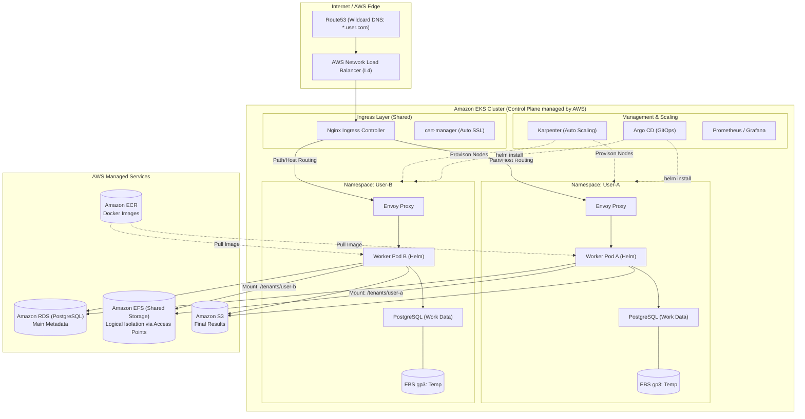
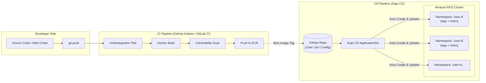

># ==== まとめ１ ==== 

これまでの議論を統合した、**「計算量が多いサービスをEKSで商用運用する」**ためのフルセット構成と、2026年現在の概算コストをまとめました。

---

## EKS商用インフラ構成 & 料金まとめ

この構成は、**「初期コストを抑えつつ、計算負荷に応じて100台単位でスケールできる」**ことを目標としています。

### 1. 基盤・計算リソース

Karpenterを活用し、計算時のみ高火力なVMを召喚する設計です。

| 項目 | 具体的なツール / サービス | 区分 | 料金（目安 / 月） | 備考 |
| --- | --- | --- | --- | --- |
| **EKS管理費** | Amazon EKS | 商用 | **約11,000円** ($73) | クラスター1つにつき固定 |
| **常時稼働VM** | EC2 (t3.medium ×2) | 商用 | **約15,000円** | 管理Pod用（リザーブドインスタンスで半額可） |
| **計算用VM** | EC2 (C6i / G5 等) | 商用 | **従量課金** | **スポットインスタンス利用で定価の70-90%オフ** |
| **スケーラー** | **Karpenter** | **OSS** | **0円** | VMの増減を自動化する司令塔 |
| **NAT Gateway** | AWS Network | 商用 | **約10,000円〜** | 1つにつき。通信量に応じて加算 |

### 2. ストレージ（適材適所の使い分け）

Workerには速さを、Controllerには共有を。

| 項目 | 具体的なツール / サービス | 区分 | 料金（目安 / 月） | 備考 |
| --- | --- | --- | --- | --- |
| **共有フォルダ** | **Amazon EFS** | 商用 | **約5,000円〜** | $0.3/GB。読み書き頻度で変動 |
| **Worker作業場** | **Amazon EBS (gp3)** | 商用 | **約1,500円〜** | $0.08/GB。100GB使用時 |
| **最終保存先** | **Amazon S3** | 商用 | **約3,500円〜** | $0.023/GB。1TB保存時 |

### 3. データベース・管理

ステートフルなデータは安全な場所に置きます。

| 項目 | 具体的なツール / サービス | 区分 | 料金（目安 / 月） | 備考 |
| --- | --- | --- | --- | --- |
| **メインDB** | **Amazon RDS (PostgreSQL)** | 商用 | **約12,000円〜** | db.t4g.medium 等。冗長化で倍増 |
| **ワークDB** | **Pod内 PostgreSQL** | **OSS** | **0円** | 上記EBS料金のみで動作 |
| **秘密情報** | Secrets Manager | 商用 | **約1,000円〜** | シークレット1件につき$0.4 |

### 4. 運用・CI/CD

GitOpsによる自動デプロイ環境です。

| 項目 | 具体的なツール / サービス | 区分 | 料金（目安 / 月） | 備考 |
| --- | --- | --- | --- | --- |
| **構成管理** | **Terraform** | **OSS** | **0円** | 実行環境（GitHub等）の無料枠内 |
| **デプロイ** | **Argo CD** | **OSS** | **0円** | EKS内のリソースを微量消費 |
| **イメージ管理** | Amazon ECR | 商用 | **数千円** | ストレージと転送量 |

---

## 合計コストのイメージ（月額）

* **待機時（固定費）: 約55,000円 〜 70,000円**
* 内訳：EKS管理費 + NAT Gateway + 常時稼働Node + RDS。
* 「誰も使っていなくてもかかる最低料金」です。

* **計算実行時: 上記 ＋ スポットインスタンス代（実費）**
* 計算用Workerが10台、1時間フル稼働しても、スポットなら数百円〜千円程度の追加で済むのがEKS+Karpenterの強みです。

---

## 結論：あなたが手にするもの

この構成に投資することで、あなたは以下の「商用グレード」の武器を手にします。

1. **無限のスケール:** ユーザーが1人でも1,000人でも、計算待ちが発生すれば数秒でサーバーが並びます。
2. **運用の自動化:** `git push` すれば、テスト環境や本番環境（Namespace）へ安全にデプロイされます。
3. **データの安全性:** 計算機はいくら壊れても、RDSとS3にあるデータは守られます。

**「月5〜7万円の固定費」**は決して安くはありませんが、**「どんな重い計算リソースの要求にも耐えられる、落ちないインフラ」**を一人で管理できる価値は非常に大きいです。

さて、この「月5〜7万円」という現実的な数字を見て、**「まずはこの構成でTerraformを書き始める」**か、あるいは**「もっとコストを削ぎ落とした最小構成（例：NAT GWを削る、RDSをやめる等）」**を模索するか、どちらの方向に進みたいですか？

---
---
 
 

># ==== まとめ２ ==== 

これまでの議論を統合した、**「計算量が多いサービスをEKSで商用運用する」**ためのフルセット構成と、2026年現在の概算コストをまとめました。

---

## EKS商用インフラ構成 & 料金まとめ

この構成は、**「初期コストを抑えつつ、計算負荷に応じて100台単位でスケールできる」**ことを目標としています。

### 1. 基盤・計算リソース

Karpenterを活用し、計算時のみ高火力なVMを召喚する設計です。

| 項目 | 具体的なツール / サービス | 区分 | 料金（目安 / 月） | 備考 |
| --- | --- | --- | --- | --- |
| **EKS管理費** | Amazon EKS | 商用 | **約11,000円** ($73) | クラスター1つにつき固定 |
| **常時稼働VM** | EC2 (t3.medium ×2) | 商用 | **約15,000円** | 管理Pod用（リザーブドインスタンスで半額可） |
| **計算用VM** | EC2 (C6i / G5 等) | 商用 | **従量課金** | **スポットインスタンス利用で定価の70-90%オフ** |
| **スケーラー** | **Karpenter** | **OSS** | **0円** | VMの増減を自動化する司令塔 |
| **NAT Gateway** | AWS Network | 商用 | **約10,000円〜** | 1つにつき。通信量に応じて加算 |

### 2. ストレージ（適材適所の使い分け）

Workerには速さを、Controllerには共有を。

| 項目 | 具体的なツール / サービス | 区分 | 料金（目安 / 月） | 備考 |
| --- | --- | --- | --- | --- |
| **共有フォルダ** | **Amazon EFS** | 商用 | **約5,000円〜** | $0.3/GB。読み書き頻度で変動 |
| **Worker作業場** | **Amazon EBS (gp3)** | 商用 | **約1,500円〜** | $0.08/GB。100GB使用時 |
| **最終保存先** | **Amazon S3** | 商用 | **約3,500円〜** | $0.023/GB。1TB保存時 |

### 3. データベース・管理

ステートフルなデータは安全な場所に置きます。

| 項目 | 具体的なツール / サービス | 区分 | 料金（目安 / 月） | 備考 |
| --- | --- | --- | --- | --- |
| **メインDB** | **Amazon RDS (PostgreSQL)** | 商用 | **約12,000円〜** | db.t4g.medium 等。冗長化で倍増 |
| **ワークDB** | **Pod内 PostgreSQL** | **OSS** | **0円** | 上記EBS料金のみで動作 |
| **秘密情報** | Secrets Manager | 商用 | **約1,000円〜** | シークレット1件につき$0.4 |

### 4. 運用・CI/CD

GitOpsによる自動デプロイ環境です。

| 項目 | 具体的なツール / サービス | 区分 | 料金（目安 / 月） | 備考 |
| --- | --- | --- | --- | --- |
| **構成管理** | **Terraform** | **OSS** | **0円** | 実行環境（GitHub等）の無料枠内 |
| **デプロイ** | **Argo CD** | **OSS** | **0円** | EKS内のリソースを微量消費 |
| **イメージ管理** | Amazon ECR | 商用 | **数千円** | ストレージと転送量 |

---

## 合計コストのイメージ（月額）

* **待機時（固定費）: 約55,000円 〜 70,000円**
* 内訳：EKS管理費 + NAT Gateway + 常時稼働Node + RDS。
* 「誰も使っていなくてもかかる最低料金」です。

* **計算実行時: 上記 ＋ スポットインスタンス代（実費）**
* 計算用Workerが10台、1時間フル稼働しても、スポットなら数百円〜千円程度の追加で済むのがEKS+Karpenterの強みです。

---

## 結論：あなたが手にするもの

この構成に投資することで、あなたは以下の「商用グレード」の武器を手にします。

1. **無限のスケール:** ユーザーが1人でも1,000人でも、計算待ちが発生すれば数秒でサーバーが並びます。
2. **運用の自動化:** `git push` すれば、テスト環境や本番環境（Namespace）へ安全にデプロイされます。
3. **データの安全性:** 計算機はいくら壊れても、RDSとS3にあるデータは守られます。

**「月5〜7万円の固定費」**は決して安くはありませんが、**「どんな重い計算リソースの要求にも耐えられる、落ちないインフラ」**を一人で管理できる価値は非常に大きいです。

さて、この「月5〜7万円」という現実的な数字を見て、**「まずはこの構成でTerraformを書き始める」**か、あるいは**「もっとコストを削ぎ落とした最小構成（例：NAT GWを削る、RDSをやめる等）」**を模索するか、どちらの方向に進みたいですか？

---
---
 
 

># ==== サーバ証明書 ==== 

信頼できる商用認証局（DigiCert, GlobalSign, ZeroSSLなど）を使う場合でも、**手動である必要はありません。**

むしろ商用レベルの運用こそ、`cert-manager` を使った**「自動更新」**が標準です。手動更新は、数年後の「更新し忘れによるサービス停止」という最大の商用リスクを招くため、避けるのが一般的です。

商用CAを自動化する仕組みと、それぞれの料金・特徴をまとめます。

---

## 1. 商用CAを自動化する3つの方法

「信頼のある認証局」を `cert-manager` と連携させる方法は、主に以下の3つです。

### ① ACME プロトコル対応の商用CAを使う (推奨)

Let's Encryptと同じ仕組み（ACME）を、有料の認証局（ZeroSSLやGoogle Public CA、DigiCert等）も提供しています。

* **仕組み:** `cert-manager` の設定にある「接続先URL」を商用CAのものに変えるだけです。
* **メリット:** 完全に自動で更新され、ブラウザからの信頼性も高いです。
* **料金:** 各CAの契約プランによります（1ドメイン数千円〜数万円/年など）。

### ② 外部イシュアー (External Issuers) を使う

`cert-manager` には、大手認証局が公式に提供しているプラグインがあります。

* **対応局:** DigiCert, GlobalSign, Sectigo (Venafi) など。
* **メリット:** 各CAの管理画面（CertCentral等）とAPI連携し、企業審査済みの証明書をK8sが勝手に取ってきてくれます。

### ③ AWS Certificate Manager (ACM) で発行してエクスポートする

AWSが発行する「信頼された証明書」を、EKS内のPod（Nginx/Envoy）で使う方法です。

* **仕組み:** ACMで証明書を発行し、それをファイルとして書き出してPodに渡します。
* **料金:** **1枚につき約$149 (Wildcardの場合)**。
* **注意点:** 本来ACMはALBなどのAWSサービス用なので、Pod内で使うための「エクスポート」には追加費用がかかります。

---

## 2. 証明書周りのまとめ（料金・自動化）

| 証明書の種類 | 自動化ツール | 区分 | 証明書自体の料金 | 備考 |
| --- | --- | --- | --- | --- |
| **Let's Encrypt** | cert-manager | OSS | **0円** | 90日ごとに自動更新 |
| **商用ACME CA** | cert-manager | 商用 | **実費 (数千円〜)** | 例：ZeroSSL等。更新は自動 |
| **大手商用CA** | 外部プラグイン | 商用 | **契約プランによる** | 例：DigiCert等。APIで自動化可能 |
| **AWS ACM** | AWS CLI等 | 商用 | **1枚 約2.2万円** | エクスポートしてPodで使う場合 |

---

## 3. 結局どうすればいい？

「それなりの信頼」を重視しつつ、今の **Nginx + Envoy** の構成を維持するなら、以下の2つのどちらかが商用の正解です。

1. **確実な自動化を狙うなら:** ACMEプロトコルに対応した **ZeroSSL** などの商用プランを `cert-manager` で運用する。
2. **既存の企業契約があるなら:** **DigiCert** 等の外部イシュアーを `cert-manager` に入れ、既存の契約枠で自動発行させる。

### なぜ「手動」はダメなのか？

商用サービスにおいて、Wildcard証明書の期限切れは「全ユーザーへの影響」を意味します。EKSのようなモダンな環境では、**「人間がファイルをアップロードする」という作業自体をTerraformやcert-managerで排除する**のが、信頼性を担保する唯一の方法です。

「特定の認証局（例：GlobalSignなど）をすでに会社で契約している」などの事情はありますか？それによって、どのプラグインを使うべきかアドバイスできます。

次は、**「商用CAをEKSに組み込むためのcert-managerの設定例」**を見てみますか？

---
---
 
 

># ==== サーバ証明書 ==== 

信頼できる商用認証局（DigiCert, GlobalSign, ZeroSSLなど）を使う場合でも、**手動である必要はありません。**

むしろ商用レベルの運用こそ、`cert-manager` を使った**「自動更新」**が標準です。手動更新は、数年後の「更新し忘れによるサービス停止」という最大の商用リスクを招くため、避けるのが一般的です。

商用CAを自動化する仕組みと、それぞれの料金・特徴をまとめます。

---

## 1. 商用CAを自動化する3つの方法

「信頼のある認証局」を `cert-manager` と連携させる方法は、主に以下の3つです。

### ① ACME プロトコル対応の商用CAを使う (推奨)

Let's Encryptと同じ仕組み（ACME）を、有料の認証局（ZeroSSLやGoogle Public CA、DigiCert等）も提供しています。

* **仕組み:** `cert-manager` の設定にある「接続先URL」を商用CAのものに変えるだけです。
* **メリット:** 完全に自動で更新され、ブラウザからの信頼性も高いです。
* **料金:** 各CAの契約プランによります（1ドメイン数千円〜数万円/年など）。

### ② 外部イシュアー (External Issuers) を使う

`cert-manager` には、大手認証局が公式に提供しているプラグインがあります。

* **対応局:** DigiCert, GlobalSign, Sectigo (Venafi) など。
* **メリット:** 各CAの管理画面（CertCentral等）とAPI連携し、企業審査済みの証明書をK8sが勝手に取ってきてくれます。

### ③ AWS Certificate Manager (ACM) で発行してエクスポートする

AWSが発行する「信頼された証明書」を、EKS内のPod（Nginx/Envoy）で使う方法です。

* **仕組み:** ACMで証明書を発行し、それをファイルとして書き出してPodに渡します。
* **料金:** **1枚につき約$149 (Wildcardの場合)**。
* **注意点:** 本来ACMはALBなどのAWSサービス用なので、Pod内で使うための「エクスポート」には追加費用がかかります。

---

## 2. 証明書周りのまとめ（料金・自動化）

| 証明書の種類 | 自動化ツール | 区分 | 証明書自体の料金 | 備考 |
| --- | --- | --- | --- | --- |
| **Let's Encrypt** | cert-manager | OSS | **0円** | 90日ごとに自動更新 |
| **商用ACME CA** | cert-manager | 商用 | **実費 (数千円〜)** | 例：ZeroSSL等。更新は自動 |
| **大手商用CA** | 外部プラグイン | 商用 | **契約プランによる** | 例：DigiCert等。APIで自動化可能 |
| **AWS ACM** | AWS CLI等 | 商用 | **1枚 約2.2万円** | エクスポートしてPodで使う場合 |

---

## 3. 結局どうすればいい？

「それなりの信頼」を重視しつつ、今の **Nginx + Envoy** の構成を維持するなら、以下の2つのどちらかが商用の正解です。

1. **確実な自動化を狙うなら:** ACMEプロトコルに対応した **ZeroSSL** などの商用プランを `cert-manager` で運用する。
2. **既存の企業契約があるなら:** **DigiCert** 等の外部イシュアーを `cert-manager` に入れ、既存の契約枠で自動発行させる。

### なぜ「手動」はダメなのか？

商用サービスにおいて、Wildcard証明書の期限切れは「全ユーザーへの影響」を意味します。EKSのようなモダンな環境では、**「人間がファイルをアップロードする」という作業自体をTerraformやcert-managerで排除する**のが、信頼性を担保する唯一の方法です。

「特定の認証局（例：GlobalSignなど）をすでに会社で契約している」などの事情はありますか？それによって、どのプラグインを使うべきかアドバイスできます。

次は、**「商用CAをEKSに組み込むためのcert-managerの設定例」**を見てみますか？

---
---
# ==== まとめ３ ==== 

その「Namespaceごとに同じHelmパッケージをデプロイする」という運用は、まさに**SaaS（マルチテナント）モデルの理想形**です。

商用EKSに移行する際、その「手動のhelm install」を**「GitOps（Argo CD）」**で自動化すると、運用コストが激減し、信頼性が一気に上がります。

---

## 1. 運用を自動化する「Argo CD ApplicationSet」

現在は、新しいユーザーが増えるたびに手動で `helm install` を実行しているかと思います。商用EKSでは **Argo CD** の **ApplicationSet** という機能を使います。

* **仕組み:** 「ユーザーリスト（Git上の設定ファイルやディレクトリ）」を監視し、新しい名前が追加されたら、**Argo CDが勝手にそのユーザー用のNamespaceを作り、Helmをデプロイ**します。
* **メリット:** * コマンドミスがゼロになる。
* 全ユーザーのデプロイ状況が一目でわかる。
* 共通のバグ修正でHelmチャートを更新した際、100ユーザー分を一括で安全にアップデート（ローリングアップデート）できる。

---

## 2. プライベートレジストリ (ECR) との連携

現在お使いのプライベートレジストリを **Amazon ECR** に移行すると、認証周りが非常に楽になります。

* **ECRのメリット:** EKSのノード（Karpenterが立てたVM）に適切なIAM権限を持たせるだけで、`imagePullSecrets` を書かなくても自動でイメージを引き抜けます。
* **安全性:** イメージの脆弱性スキャン（Amazon Inspector）が自動で走り、危険なイメージが本番にデプロイされるのを防げます。

---

## 3. 商用マルチテナントの「3つの壁」と対策

ユーザーごとにNamespaceを分ける際、商用環境で必ず直面する課題と解決策です。

### ① ストレージの競合 (EFS Access Points)

「1つの共有ストレージ（EFS）をみんなで使う」というお話がありましたが、Namespace-AのユーザーがNamespace-Bのデータを覗けないようにする必要があります。

* **解決策:** TerraformでEFSの **Access Points** をNamespace分だけ自動作成します。これを各NamespaceのPVCに紐付けることで、ストレージ層で完全に分離できます。

### ② リソースの独占 (Resource Quotas)

ある特定のユーザーの計算処理が暴走して、クラスタ全体のメモリを使い果たし、他のユーザーを止めてしまうリスクがあります。

* **解決策:** 1つのNamespaceが使える最大CPU/メモリを制限（Quota）します。はみ出した分は **Karpenter** が新しいVMを連れてくることで、他のユーザーに影響を与えずにスケールさせます。

### ③ 通信の混線 (Network Policy)

デフォルトのKubernetesは全Namespace間で通信が可能です。

* **解決策:** `NetworkPolicy` を設定し、「自分のNamespace内と、外部DB（RDS）への通信以外は遮断する」という壁を作ります。

---

## 4. 全体まとめ（最終的なインフラ像）

| 機能 | 現在のやり方 | 商用EKSでの推奨 |
| --- | --- | --- |
| **デプロイ** | 手動 `helm install` | **Argo CD ApplicationSet** (自動) |
| **イメージ管理** | Private Registry | **Amazon ECR** (AWS統合) |
| **DNS/証明書** | (おそらく手動) | **ExternalDNS + cert-manager** (自動) |
| **スケーリング** | 固定Node or 手動増設 | **Karpenter** (負荷に応じた自動召喚) |
| **ストレージ** | 共有PV | **EFS Access Points** (Namespace間分離) |

---

## 結論：何が変わるのか？

この構成に移行すると、あなたの仕事は「新しいユーザーのために `helm install` を打つこと」ではなく、**「Gitに新しいユーザー名を1行書き加えること」**に変わります。

あとは、Terraformが土台を維持し、Karpenterが計算機を調達し、Argo CDがアプリを並べ、cert-managerが証明書を整えます。

**「Gitに1行書くだけで、インフラの全てが自動で動き出す」**。そんな商用環境の構築に向けて、まずは**「TerraformでArgo CDをインストールし、最初のApplicationSet（自動Helmデプロイ設定）を作るところ」**から始めてみませんか？

具体的に、**ApplicationSetの書き方（コード例）**を見てみますか？それとも**ECRへの移行手順**が気になりますか？

---
---
 
 

># ==== まとめ４ ==== 

承知いたしました。**EFS Access Point**を中核に据えた、商用マルチテナント計算基盤の最終まとめです。

「1つの巨大な共有ストレージを、安全・自動・高速に切り出す」という、非常にスケーラブルな構成になります。

---

## 1. 全体アーキテクチャの役割まとめ

「仕組み（OSS）」と「実体（AWS）」の役割を完全に分離します。

| レイヤー | 採用テクノロジー | 役割 | 区分 |
| --- | --- | --- | --- |
| **入口** | **Route53 + NLB + Nginx** | Wildcard DNSによるトラフィックの自動振り分け。 | 商用/OSS |
| **計算** | **EKS + Karpenter** | Pod（Worker）の要求に応じて最適なVMを自動召喚。 | 商用/OSS |
| **共有保存** | **EFS Access Point** | **今回の肝。** 1つのEFSを論理的・物理的にNamespace毎に隔離。 | **商用** |
| **一時保存** | **EBS (gp3)** | 各Worker Pod専用の爆速作業領域。使い捨て。 | 商用 |
| **永続データ** | **Amazon RDS** | ユーザー情報やジョブの進捗（メタデータ）の保管。 | 商用 |
| **デプロイ** | **Argo CD** | Namespace作成からHelmデプロイまでを完全自動化。 | **OSS** |

---

## 2. EFS Access Point による隔離の仕組み

従来の `subPath` 運用を、AWSのインフラ層でより強固にした形です。

* **論理的な「ルートディレクトリ」の固定:**
各NamespaceのPodからは、EFSの `/` をマウントしているつもりでも、実際には `/tenants/user-a/` しか見えません。上の階層（他人のデータ）には物理的に遡れません。
* **UID/GIDの強制:**
コンテナ内のユーザーが誰であれ、書き込まれるファイルの所有権を「UID:1001」などに強制固定します。これにより、ファイル権限の混乱を防ぎます。

---

## 3. 料金シミュレーション（月額目安）

「共有ストレージ 1つ」をみんなで使うため、ユーザーが増えてもベースの固定費は抑えられます。

| 項目 | 概算費用（月額） | 備考 |
| --- | --- | --- |
| **固定費（ベース）** | **約 58,000円〜** | EKS管理費, NLB, NAT-GW, 管理Node(t3), RDS(t4g) |
| **ストレージ（EFS）** | **実費（$0.3/GB）** | 100GB使用で約4,500円。使った分だけ。 |
| **計算費（Worker）** | **従量課金** | **スポットインスタンス活用で定価の7割以上オフ** |
| **証明書/DNS** | **約 2,000円〜** | 商用CA（ACME自動更新） |

---

## 4. Terraform で定義する「ユーザー追加」のワークフロー

商用環境では、新しいユーザーが増えた時に以下のコードが自動生成されるようにします。

1. **AWSリソース:** `aws_efs_access_point` を作成（特定のパスを指定）。
2. **K8sリソース:** そのアクセスポイントIDを埋め込んだ `PersistentVolume` と `PersistentVolumeClaim` を作成。
3. **アプリ:** そのPVCを `/data` などにマウントする `Helm chart` をデプロイ。

---

## 5. まとめ：この構成で得られる「商用品質」

* **堅牢なセキュリティ:** `subPath` 設定ミスによる情報漏洩リスクをインフラ層で排除。
* **運用の自動化:** ユーザー追加はGitに名前を書くだけ。HelmのデプロイもArgo CDにお任せ。
* **コスト最適化:** 計算機（VM）はKarpenterがスポットで安く調達し、ストレージ（EFS）は全員でシェア。

### 次のステップへのご提案

この「EFS Access Point」をベースにした構成を実際に作るための、**「Terraformのサンプルコード（EFS作成 ＋ Access Point定義）」**を作成しましょうか？

それとも、**「Argo CDを使って、このストレージ設定を各Namespaceにどう自動分配するか」**というデプロイ戦略の詳細を詰めますか？

---
---

