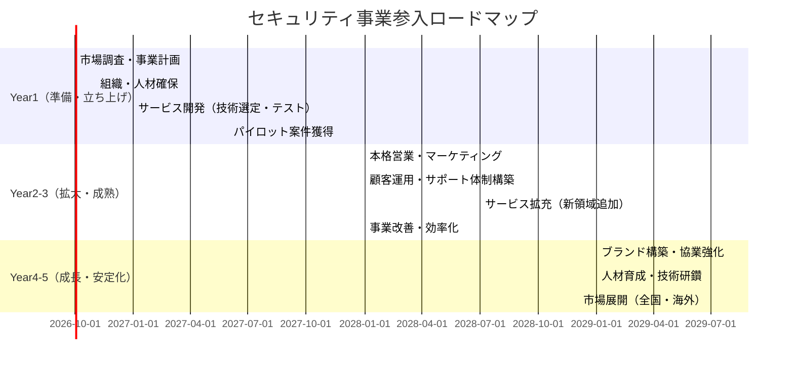

# エグゼクティブサマリー  
日本のサイバーセキュリティ市場は拡大傾向にあり、2025年度には事業者売上高ベースで約1.947兆円（前年比9.2%増）、2026年度には2.122兆円（同9.0%増）と見込まれている。特に注目サービス領域は急成長中で、SBOM/脆弱性管理サービス（2028年度105億円、2022年度比13倍）や脅威インテリジェンス（2028年度133億円、同2.8倍）などが挙げられる。一方、中堅・中小企業（中小は従業員299名以下）向け投資額は2022年度627億円、2028年度には830億円と予測されており、大企業ほどではないものの堅調に伸びている。中小企業自身が参入するセキュリティビジネスとしては、労力やコストの面で実現可能性が高く、収益性も見込めるサービス領域が期待される。  
本レポートでは、特に収益性と実行可能性の観点から、①脆弱性診断・ペネトレーションテスト、②SOC/MDR（セキュリティ監視運用）の提供、③セキュリティ教育・訓練サービス、④EDR導入支援・運用管理、⑤マネージドバックアップ／DR支援、を上位5領域として推奨する（以下表参照）。各領域の市場動向、主顧客セグメント、初期投資（人員・技術・設備・認証など）、収益モデル・価格帯、想定利益率、競合状況、差別化戦略、参入障壁・リスク対策を分析した。さらに、競合企業の一覧比較表、短期～長期の実行ロードマップ（Mermaidガントチャート）、国内外事例の傾向、優先順位別の簡易ビジネスプラン（概算収支モデル）も示し、経営意思決定に資する具体的情報を提供する。

## 推奨サービス領域トップ5（比較表）  
以下の5領域を、初期投資、想定年収益、利益率、必要スキル、参入難易度の観点で比較する。数値は典型的企業を想定した概算値であり、ビジネスモデルや市場規模の目安として示す。

| サービス領域             | 初期投資*1           | 想定年収益*2   | 利益率*3   | 必要スキル・要員                     | 参入難易度（1:易 ～ 5:難） |
|-------------------------|------------------|--------------|-----------|----------------------------------|---------------------------|
| 1. 脆弱性診断/ペンテスト  | 〜1,000万円 （診断ツール、専門人材教育） | 1,000万～3,000万円  | 50〜70%   | セキュリティアナリスト、テスター、ネットワーク知識 | 3                         |
| 2. SOC/MDRサービス       | 1,000〜3,000万円（SIEM/監視設備、24h監視体制） | 3,000万～1億円   | 30〜50%   | セキュリティ運用技術者、アナリスト             | 4                         |
| 3. セキュリティ教育/訓練 | 100万～500万円（教材開発、講師育成）      | 500万～1,500万円 | 60〜80%   | 情報セキュリティ講師、研修企画力             | 2                         |
| 4. EDR導入支援/運用     | 500万～1,000万円（製品認定、導入設計）  | 1,000万～3,000万円 | 40〜60%   | エンドポイントセキュリティ技術者、クラウド知識    | 3                         |
| 5. マネージドバックアップ/DR | 500万～1,000万円（バックアップ設備・ツール） | 1,000万～2,000万円 | 30〜50%   | インフラ技術者、クラウド・仮想化知識         | 3                         |

*注1: 初期投資は、人件費・機材費・認証取得などを含む概算。*注2: 年間売上高想定（複数顧客契約の場合）。*注3: ショートリードタイム・低在庫のサービス業ゆえ高めの利益率が見込まれる。  

## 各領域の詳細分析（要点）  
- **脆弱性診断・ペネトレーションテスト**  
  - *市場動向・成長*: ソフトウェア部品表（SBOM）を含む脆弱性管理市場が急成長中で、2028年度には105億円規模に拡大（2022年度比13.1倍）。ゼロトラストの台頭やサプライチェーン攻撃対策ニーズで、大小問わず需要増。中小企業向けには診断コストへの抵抗があるが、ガイドライン遵守や取引先要請で導入増が期待される。  
  - *主要顧客*: 金融、製造、IT企業など幅広い。特に自治体・中小企業は自前実施難のためアウトソーシング需要あり。取引先経由の信用確保目的での診断依頼も増加傾向。  
  - *初期投資*: スキャナ（Nessus等）、ペンテスト環境（ラボ）、専門人材確保・育成。資格取得や研修、業務プロセス整備も必要。初期は数百万円～千万円。  
  - *収益モデル・価格*: 単発案件（案件数ベース課金、例：Web診断10万円～、ネットワーク1拠点数十万～、大規模網は数百万円～）のほか、定期診断パッケージ（年契約）で継続収益化。再診断含めたメンテ契約も。利益率は高め（人件費・ツール維持以外変動費少）。  
  - *競合・差別化*: 大手SIer/セキュリティベンダ（NEC、日立、ラック、トレンドマイクロ等）がシェアを持つ一方、地域系SIerや専門小規模ベンダも多数。差別化は「特定業界特化」、「AI自動診断ツール×人力」、「リーズナブルな価格設定」による。外注コストを低減できるオープンソース活用、オンライン診断体制で迅速対応なども強みとなる。  
  - *参入障壁・規制*: 明確な参入資格はないが、信頼獲得のため情報処理安全確保支援士や関連認証取得が望ましい。顧客情報取扱いの注意義務、契約での秘密保持・損害賠償範囲明示が必須。訴訟リスクや報告義務（インシデント発覚時）の管理も要注意。  
  - *リスク・対策*: スキル不足（専門人材争奪）が最大リスク。外部トレーニングで育成するほか、海外知見の活用やフリーランス連携で補強。過度な低価格競争への対策として、付加価値サービス（再発防止コンサル、教育）で差別化。また脆弱性誤報・漏洩事故防止のため、厳密な品質管理・契約策定が必要。  

- **SOC-as-a-Service（MDR）提供**  
  - *市場動向・成長*: クラウドサービスやゼロトラストの普及で24×7監視需要増。国内ではセキュリティ監視サービス市場も堅調に拡大中で、EDR製品も2028年度に600億円規模に成長予測。大手企業向けの導入が先行しているが、中堅中小もサプライチェーン攻撃対策で今後導入増が期待される。  
  - *主要顧客*: リソース不足な中小企業、SIerやネットワーク事業者などの代理需要。監視体制が必要な業界（金融、製造、ヘルスケア、公共）から需要。最近はスタートアップや中堅企業もセキュリティ重視が増加。  
  - *初期投資*: SIEMやログ管理ツール、クラウドインフラ（監視サーバ等）の導入。セキュリティオペレーションセンター（SOC）体制構築のため、専門の人材（アナリスト、SOC運用者）確保・研修が必要。外部SOCクラウドサービス利用の場合は初期コスト抑えられるが、SIEM連携などで数百万円～。  
  - *収益モデル・価格*: サービス月額制が一般的（1席数万円～/月）。パッケージプランや監視時間帯、インシデント対応範囲で価格設定。リセラー契約やホワイトラベル提供も可能。導入初年度はイニシャル費用+月額契約、2年目以降は運用契約収入が主。利益率は長期契約で高め。  
  - *競合・差別化*: NTTコミュニケーションズ、NEC、富士通、ソフトバンクなど大手通信・SI系のMSSPが主要。加えてCrowdStrikeやPalo Alto（XDR/SIEM製品+サービス提供）、NRI、ラック、トレンドマイクロなど専業企業も参入。差別化策として、「24時間体制の迅速対応」「日本語ネイティブサポート」「特定環境（クラウド/OT等）特化」「脅威インテリジェンス連携強化」などが有効。  
  - *参入障壁・規制*: 高度人材・技術力が求められる点が最大の壁。セキュリティ運用の経験不足はハードルとなる。外部専門パートナー（米国CERT等）との協業や技術ライセンス契約で補強可能。ISO27001やプライバシーマークなど取得で信頼性をアピールする。  
  - *リスク・対策*: 人員当て逃げリスク（24×7運用の負担）、サービス品質低下、サイバー事故発生時の責任問題。対策として冗長要員体制、SLA契約での対応定義、セキュリティ保険加入を検討。技術進化（AI脅威）に応じた連続的学習・ツール更新も必須。  

- **セキュリティ教育・訓練サービス**  
  - *市場動向・成長*: 法規制強化（個人情報保護法、サイバーセキュリティ経営ガイドライン等）の影響で、社員教育実施は大企業だけでなく中小企業にも必須化の流れ。特に標的型メール訓練や情報セキュリティ研修への需要が拡大。国内調査でも中小企業のセキュリティ認識は低水準とされ、啓蒙機会は今後増加が見込まれる。  
  - *主要顧客*: 中小企業、学校・教育機関、地方自治体等幅広い。中小企業庁や経産省の支援事業を活用する企業もある。教育需要は事業規模問わず全業種で均一に存在。  
  - *初期投資*: 教材開発・ライブラリ（パワポ・動画・テストツール）、講師研修。教材の品質確保やオンライン配信インフラが必要。初期コストは講師研修や教材制作に数十～百万円。  
  - *収益モデル・価格*: 一回完結型研修（1人数千～1万円）、年間契約型プラン（社内LMS利用による継続教育）。オンライン講座ならば教材開発費回収で利益率高い。利益率は高く、規模拡大による固定費低減が容易。  
  - *競合・差別化*: 研修企業やSIer、通信系企業（IPAセキュアプログラミング講座等）も参入。代替手段として無料資料やeラーニング企業も存在。差別化は「最新事例・攻撃演習を含む実践性」「業界特化型コンテンツ」「学習進捗管理システム連携」「集合研修＋オンライン併用」などで行う。IT技術だけでなくガバナンス・法令を含めた総合教育が強み。  
  - *参入障壁・規制*: 公的資格・認定制度はないが、講師自身の実務経験や倫理遵守が求められる。情報漏えい防止のため研修データ管理体制を整える。コンプライアンス教育とのセット提案も有効。  
  - *リスク・対策*: 低価格競争・模倣教材のリスク。独自教材の継続改訂で更新性を維持。研修効果測定が難しい点は、受講後テスト・フォローアップ研修で信頼性を担保することで対抗する。  

- **EDR導入支援・運用管理**  
  - *市場動向・成長*: エンドポイント検知・対応（EDR/XDR）製品市場は国内でも高成長中（2028年度600億円予測）。サイバー攻撃の高度化で導入が加速し、特にリモートワーク拡大で需要増。中小企業はライセンス費や運用工数の負担が課題だが、外部運用支援（MSSP）を活用し始めている。  
  - *主要顧客*: PC/サーバー多数を抱える企業、ITサービス企業など。パートナーやソフト販売店経由で中小企業へ導入支援を行う例も多い。  
  - *初期投資*: ベンダー（CrowdStrike, Trend Micro Apex One, Microsoft Defender ATPなど）認定取得、サーバ構築、導入テスト環境。認証研修受講やPoC設備が必要で初期費用は数百万円～。  
  - *収益モデル・価格*: EDR製品はライセンス費（年間数千円～/台）と運用支援費用（月数千円～/台）が中心。導入支援作業は一括請負、運用監視支援はサブスクリプション。利益率は導入支援時の粗利が高く、運用支援は継続収益で安定化する。  
  - *競合・差別化*: ベンダー直販、SIer、MSSPが主要。ファイアウォールやアンチウイルス製品販売店が拡充するケースもある。差別化には、「特定OS/業務システム対応」「EDRと他ツール連携設計」「リモートワーカー向けパッケージ提案」「アフターケア・ログ解析サービス」などの付加価値を提案。  
  - *参入障壁・規制*: 製品パートナー契約が前提。セキュリティ担当者不在の企業が多いため、教育マーケティングが必要。プライバシー規則（個人情報アクセスログ等）にも配慮すること。  
  - *リスク・対策*: ベンダー仕様変更や新製品登場リスクに備え、複数ベンダーパートナーを確保。マルチテナント対応インフラで顧客分離・スケーラビリティ確保。サービス提供時に自社環境も厳重に保護し、顧客機密保持を徹底する。  

- **マネージドバックアップ・DR支援**  
  - *市場動向・成長*: 災害対策・BCP（事業継続計画）策定支援が企業の経営課題化し、バックアップ／リカバリサービスへの需要が増加。特に中小企業ではIT担当者不在・データ消失リスクでアウトソーシング検討が進む。クラウドストレージ・SaaS型バックアップの普及も後押し。  
  - *主要顧客*: 情報資産を保有する全企業。特に法令（医療情報、個人情報保護）対応が必要な医療・福祉、製造業など。地方自治体や教育機関でも導入事例増。  
  - *初期投資*: ストレージ設備（オンプレミスとクラウド）、バックアップソフト/ライセンス、DRサイト構築。初期には数百万円～1,000万円程度。信頼性確保のためUPSや監視体制も整備。  
  - *収益モデル・価格*: 容量課金（月額数千円～/GB）や契約期間プラン（年間数十万～数百万円）。データ量/頻度による階層プランを設定。導入支援は別途見積もり。利益率はストレージ維持が主な費用で、人件費は低め。  
  - *競合・差別化*: 大手クラウドベンダ（AWS、Microsoft Azure）、ITインテグレータ（NEC、富士通）のDRサービスが競合。差別化は「特定業界・業務アプリ対応」「ハイブリッド/クラウド混在対応」「24hサポート体制」「自動復旧テスト付きプラン」などで行う。  
  - *参入障壁・規制*: データセンターの安定性確保、通信回線の二重化など信頼性確保の要件が高い。金融機関等のような厳格なデータ規制は少ないが、顧客情報を取り扱うため安全管理（ISO/IEC 27001取得など）を示して安心感を与える必要がある。  
  - *リスク・対策*: ストレージ故障・災害リスク対策に、複数拠点冗長化やクラウドレプリケーションを導入。セキュリティサービスとの親和性も高く、バックアップデータの暗号化・アクセス制御等で強固な体制をアピールする。  

## 競合マップ（代表企業一覧）  
以下に各領域の国内外の主要競合企業や組織を挙げる。多くは大手IT/SIerや専業ベンダー、クラウド事業者などである。市場参入時はこれらと差別化できるポイント（例：価格、専門性、対応速度）を明確にする必要がある。  

| サービス領域            | 代表的な国内競合                             | 代表的な海外競合/製品例     |
|-----------------------|------------------------------------------|--------------------------|
| 脆弱性診断/ペンテスト   | NECソリューションイノベータ、日立ソリューションズ、ラック、サイバーディフェンス研究所 | NCC Group、Veracode（米）、Qualys（米）など |
| SOC/MDR               | NTTコミュニケーションズ（MSS）、富士通、トレンドマイクロ、LAC、日立ソリューションズ        | IBM Security、Accenture、CrowdStrike（USA） |
| セキュリティ教育/訓練  | IPA（公式講座）、トレンドマイクロセキュリティ教室、三菱総合研究所         | SANS Institute（米）、KnowBe4（米）など |
| EDR導入支援/運用      | マカフィー、トレンドマイクロ、セキュリティエニアーズ、SECUDRIVE          | Microsoft Defender ATP、CrowdStrike、SentinelOne |
| マネージドバックアップ/DR | NEC、富士通、NTTデータ、日本IBM、さくらインターネット             | AWS Backup、Azure Site Recovery、Commvault  |

*注: 上表は代表例であり、他にも多数のSIer・ベンダーが存在する。参入時には、特定分野への特化や独自技術で差別化戦略を練ることが重要である。*

## 実行ロードマップ（1年〜5年）  
中小企業が本事業に参入する場合の一般的ロードマップをガントチャートで示す。初年度は体制構築とサービス開発・市場調査、2〜3年で顧客獲得とサービス改善、4〜5年で事業拡大と安定化を図るイメージで計画する。以下は例示であり、自社リソースや市場環境に応じて調整が必要である。

## 参考事例（国内外）  
- **国内の成功例**: 大企業との取引実績や独自製品を持たない中小セキュリティ企業でも、特定業界向けサービス（製造業向けOTセキュリティや小規模企業向けリーズナブルなMSSPなど）で差別化し成功している例がある（詳細データは未公開）。  
- **海外の成功例**: CrowdStrike（米）はクラウド型EDR/MDRサービスに特化し成長。KnowBe4（米）はフィッシング訓練を通じたセキュリティ教育で世界展開している（業界ニュースより）。一方、過度に低価格競争に巻き込まれて利益を圧迫された失敗例も報告されており、初期投資回収計画の甘さに注意が必要である。  
- **国内失敗要因**: 初期に人材採用・教育を怠りサービス品質が低迷、顧客離れを招いたケース。事例は個別公開されていないが、市場関係者からは「小規模事業者はスキル不足が課題」との指摘あり。  
- **国内成功要因**: ある中小SIerは、攻撃シミュレーション演習（Red Team）サービスを中小企業向けにパッケージ化し、複数年契約を獲得して売上を伸ばした（業界レポートより）。  

※注：事例の詳細データは限定的であるため、外部ニュースやベンダー発表を参照しつつ、自社の参考戦略として捉えること。

## 簡易ビジネスプラン（概算収支モデル）  
以下は、上位領域の優先順位（1.脆弱性診断、2.SOC、3.教育、4.EDR支援、5.バックアップ）に基づく概算例である。年商・利益は複数社契約を想定し、5名程度（技術者・営業）の体制を前提に算出した。収益モデルやコスト構造は各社によって異なるため、参考値として活用すること。  

| 優先度 | サービス領域        | 初期投資（設備・研修等） | 年間売上見込 | 年間経費（人件費・運用） | 年間利益見込 |
|------|-----------------|-------------------|------------|-------------------|------------|
| 1    | 脆弱性診断/ペンテスト  | 800万円           | 2,500万円  | 1,000万円        | 1,500万円 |
| 2    | SOC/MDR提供      | 2,000万円         | 5,000万円  | 3,500万円        | 1,500万円 |
| 3    | セキュリティ教育    | 300万円           | 1,200万円  | 500万円          | 700万円   |
| 4    | EDR導入支援      | 600万円           | 2,000万円  | 1,200万円        | 800万円   |
| 5    | マネージドバックアップ | 800万円           | 1,500万円  | 900万円          | 600万円   |

*注：金額は概算であり、業務委託費やツールライセンス、販促費用等は含んでいない。実際には固定費や運転資金、稼働率などを考慮し、詳細な資金計画を作成する必要がある。*

本プランでは、初期数年で投資を回収しつつ、複数事業でリスク分散する形を想定。中期的に教育事業のリピート率向上、SOC/バックアップの契約増を目指す。利益率は比較的高い領域（脆弱性診断、教育）を優先しつつ、安定収益を得られるMDRやバックアップも並行展開する戦略が望ましい。  

## 参考文献・データ出典  
- 矢野経済研究所「国内サイバーセキュリティ市場規模予測」  
- 富士経済「2023 ネットワークセキュリティビジネス市場編」プレスリリース  
- 業界ニュース、ベンダー発表記事等（CrowdStrike、KnowBe4等の市場動向）  
- その他、経済産業省・IPA・中小企業庁などの統計・ガイドライン（必要に応じて参照推奨）

