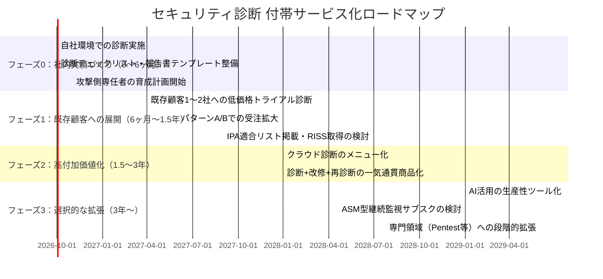

# セキュリティビジネス新規参入 事業計画書
### 〜既存のセキュリティ関連受託開発（オンプレ／クラウド）を土台とした段階的参入モデル〜

**作成日**：2026年9月
**対象読者**：既存事業（セキュリティ関連受託型システム開発、オンプレ・クラウド両対応）を持つ経営層
**位置づけ**：4本の調査レポート（脆弱性診断・ペンテスト市場分析／AI時代の事業モデル／人材戦略）の内容を精査し、実務的な観点から再構成した参入計画

---

## 0. サマリー：結論を先に

| 論点 | 結論 |
|---|---|
| 最初に何をやるか | 新規事業として独立させず、**既存受託契約の"付帯サービス"**としてセキュリティ診断を組み込む |
| 主軸商品 | クラウド設定診断（Cloud Security Assessment）＋ 既存顧客への「セキュリティ健康診断」提案 |
| 営業機能 | **新規に立てない**。既存の受託関係（パターンA／B）だけで完結させる |
| 差別化の源泉 | 技術の珍しさではなく、「作った会社が診断し、その場で改修まで一気通貫でできる」という構造的優位 |
| AI活用 | 独立商品化するのはフェーズ3以降。まずは社内の生産性向上ツールとして限定利用 |
| 資格 | 実績を先に作り、それを裏付けに資格・制度登録を後追いで取得する |

---

## 1. 前提となる分析：4本の調査レポートの評価

### 1-1. レポート群の構成

1. **security-business-1.md**：セキュリティ市場全体の俯瞰、5領域の比較（診断/ペンテスト、SOC/MDR、教育、EDR、バックアップ）
2. **security-business-2.md**：脆弱性診断・ペネトレーションテストを8事業に分解し、3フェーズの成長モデルを提示
3. **security-business-3.md**：AI時代を前提にした事業モデルの再構築（AI Security Testing Companyへの転換）
4. **security-business-4.md**：AI転換後に必要となる人材モデル・資格ロードマップ

### 1-2. 評価：良い点

- 市場データ・制度動向（経産省「情報セキュリティサービス基準」、IPA適合サービスリスト、SCS評価制度等）への目配りが的確
- 「診断＝穴があるか」「ペンテスト＝穴を使って目的達成できるか」という商品設計の整理は明快
- 単発診断 → 改修支援 → 再診断 → 継続契約というLTV設計の考え方は妥当
- 数値はいずれも「事業計画上の仮定」と明記されており、誠実な書き方

### 1-3. 評価：不足していた点（本計画で補正する部分）

| 不足点 | 内容 |
|---|---|
| ① 出発点と将来像の断絶 | 「中小企業の参入」を謳いながら、doc3/doc4はディープテック創業計画に近い人材要件を要求しており、身の丈に合わない |
| ② 営業・顧客獲得設計の欠如 | 「最初の10社をどう獲得するか」がほぼ書かれておらず、技術偏重 |
| ③ 法務・保険・ガバナンスの手薄さ | スコープ合意書、賠償責任保険、実攻撃時の承認フローへの言及が乏しい |
| ④ 組織特性とのミスマッチ | 受託開発企業は本質的に「営業が受け身」の組織であり、新規に能動的な営業機能を作る前提の計画は失敗率が高い |
| ⑤ 差別化の弱さ | クラウド診断・スマホ診断は「技術的隣接性があるから参入しやすい」が、それは競合にも等しく当てはまり、価格競争を避けられない |

---

## 2. 中核となる意思決定：どこで戦うか

### 2-1. 「実力」と「強み」は両方必要（価格勝負を避ける条件）

| 状態 | 結果 |
|---|---|
| 実力はあるが強みがない | 競合と同じ結果しか出せない → 価格だけで比較される |
| 強みはあるが実力がない | 表面化しない品質不足が事故に直結し、信用を失う |
| **実力＋強みの両方** | **価格勝負を回避できる唯一の状態** |

### 2-2. 御社にとっての「強み」の正体

技術の新しさではなく、**営業構造上、競合と同じ土俵に立たなくて済む立ち位置**から作るのが現実的。

1. **説明可能性の強さ**：内部構造・設計判断の理由まで知っているため、「なぜこの設定か」「直すと何が壊れるか」まで含めて説明できる
2. **改修まで一気通貫**：診断専業者は「穴を見つける」までが商品。御社は「診断→改修→再診断」を1社で完結できる
3. **競合が土俵に上がらない領域**：新規開拓ではなく既存の受託関係に乗せる限り、価格比較の対象にすらならない

### 2-3. 避けるべき罠

- 新規に営業組織を立ち上げて、新規顧客に「診断単体」を売り込む（＝受託開発企業のDNAと矛盾し、失敗率が高い）
- クラウド診断・スマホ診断を「技術的にできるから」という理由だけで主力商品化する（＝競合も同じ理由で参入できる）
- AI活用をいきなり独立商品として掲げる（＝技術進歩が速すぎて優位性が持続しない）

---

## 3. 事業モデル：既存事業への「付帯サービス」としての設計

### 3-1. 新規事業ではなく付帯サービスと位置づける理由

受託開発は「向こうから仕事が来る」「決まった取引先から継続発注される」性質のビジネスであり、自ら新規顧客を開拓し単価と提案内容を主導する営業機能を通常持たない。したがって、セキュリティ診断を**独立した新規事業の柱**として立てるのではなく、**既存の受託契約に組み込む粗利改善策**として位置づける。

### 3-2. 3つの受注パターン

| パターン | 内容 | 主導権 | 新規営業の要否 |
|---|---|---|---|
| **A：既存顧客への追加提案** | 現在開発・保守中の顧客に「セキュリティ健康診断」を窓口担当（PM/エンジニア）から提案 | 自社 | 不要（既存関係の延長） |
| **B：元請けSIerの下請け** | 取引のある元請けから「診断部分だけ外注したい」という声に対応 | 相手方 | 不要（受け身で対応） |
| **C：新規営業による開拓** | 自社ブランドで新規顧客に売り込む | 自社 | **必要（非推奨）** |

**本計画ではパターンA・Bの範囲に事業を絞り込む。** パターンCは組織特性と矛盾するため、当面は採用しない。

### 3-3. 成功指標の再定義

独立事業として「診断事業の年商」を追うのではなく、以下を指標にする。

- 既存受託案件の**単価・粗利の上昇率**
- 診断込み契約による**既存顧客の解約率低下**
- 診断実績を通じた**次期開発案件の受注率**（診断で見つけた課題が改修案件に直結する）

---

## 4. フェーズ別ロードマップ

### フェーズ0：社内実績づくり（0〜6ヶ月）

- 自社が構築したオンプレ／クラウド環境を対象に、社内で診断を実施し、実務経験を積む
- チェックリスト（CIS Benchmarks、クラウドベストプラクティス等）と報告書テンプレートを整備
- 攻撃側（Offensive）スキルを持つ担当者を最低1名選定し、育成を開始（後述4章参照）
- **投資規模の目安**：数十万〜200万円程度（学習教材、検証環境、資格受験費用）

### フェーズ1：既存顧客への展開（6ヶ月〜1.5年）

- 関係の深い既存顧客1〜2社に対し、無償ではなく低価格でのトライアル診断を実施
- 実績と顧客の声を蓄積し、パターンA（追加提案）・パターンB（下請け）での受注を広げる
- 実績が一定数貯まった段階で、IPA「情報セキュリティサービス基準適合サービスリスト」掲載やRISS取得を検討（資格取得を先行させない）

### フェーズ2：高付加価値化（1.5〜3年）

- クラウド設定診断を正式なメニュー化（既存のクラウド構築経験を活かせる領域）
- 「診断→その場で改修→再診断」を1社で完結する一気通貫商品を前面に打ち出す
- 診断専業他社には作れない、この一気通貫型を差別化の核とする

### フェーズ3：選択的な拡張（3年〜）

- AI活用は、レポート作成・初期トリアージなど社内の生産性向上ツールとして限定的に導入（独立商品化はまだしない）
- 外部公開資産の継続監視（ASM型）をサブスクリプション商品として検討し、ストック収益の柱を作る
- 実績と体制が整った領域から、ペネトレーションテスト等の高難度領域へ段階的に拡張

---

## 5. 比較表：本計画 vs. 元レポートの提案モデル

| 項目 | 元レポート（doc2〜4）の提案 | 本計画の再提案 |
|---|---|---|
| 事業の位置づけ | 独立した新規事業（診断・ペンテスト専門会社） | 既存受託事業への付帯サービス |
| 初動の顧客獲得 | 新規開拓・SIer提携・ホワイトラベル | 既存受託関係のみ（パターンA/B）、新規営業は当面行わない |
| 主軸商品の選定基準 | 市場成長性・技術難易度 | 既存事業との技術的隣接性＋価格競争を避けられる立ち位置 |
| 差別化の源泉 | AI活用、専門資格、レッドチーム等の高度技術 | 「作った会社が診断・改修まで一気通貫でできる」構造的優位 |
| AIの位置づけ | 事業の中心（AI-Powered Continuous Security Testing Company） | フェーズ3以降の生産性向上ツール（独立商品化は保留） |
| 人材戦略 | RISS+CISSP+OSCP+AI Security等を横断する高度人材を初期から採用 | 既存エンジニアへの攻撃側スキル追加教育を優先、専門人材採用は実績確認後 |
| 資格取得の順序 | 資格取得ロードマップを先行提示 | 実績を先に作り、資格・制度登録は後追いで取得 |
| リスクの重心 | 技術力不足リスクを重視 | 営業機能不足・組織特性とのミスマッチリスクを重視 |
| 成功指標 | 診断事業単体の年商・利益率 | 既存受託案件の単価・粗利改善、解約率低下、次期案件受注率 |

---

## 6. 商品比較表：フェーズ別の商品ポートフォリオ

| フェーズ | 商品 | 価格帯目安 | 受注パターン | 必要な追加投資 |
|---|---|---|---|---|
| 0 | 社内診断（実績作り） | ー（投資扱い） | 自社案件 | 検証環境・学習コスト |
| 1 | セキュリティ健康診断（トライアル） | 20〜50万円 | A：既存顧客 | 報告書テンプレート整備 |
| 1〜2 | Web/API・クラウド設定診断 | 50〜150万円 | A・B | 攻撃側専任者の育成 |
| 2 | 診断＋改修＋再診断（一気通貫） | 100〜300万円 | A・B | 特になし（既存開発力を活用） |
| 3 | ASM型継続監視サブスク | 月3〜10万円 | A・B（既存顧客のストック化） | 監視基盤の構築 |
| 3〜 | クラウドPentest等（高難度） | 150〜400万円 | A・B（実績確認後） | 専門人材の採用・OSCP等取得 |

※価格は事業計画上の想定レンジであり、市場価格を保証するものではない。

---

## 7. 法務・ガバナンス整備（元レポートで手薄だった部分）

新規事業化の前に、以下は必ず整備する。

1. **スコープ合意書（Rules of Engagement）の標準テンプレート化**：診断範囲、除外対象、実施時間帯、緊急停止条件を契約時に明文化
2. **サイバー賠償責任保険（E&O/Cyber Liability）への加入**：診断中の本番障害・情報漏洩に備える
3. **実攻撃検証時の承認フロー**：特に本番環境での検証は、顧客側の最終承認者を契約書レベルで固定化
4. **実績記録の保存体制**：案件・実施者・実施内容・対象環境・結果・顧客確認を記録し、将来の資格・制度登録に活用できる形で蓄積

---

## 8. 人材計画：攻撃側スキルの追加教育

既存エンジニアは防御側（作る力）に強いが、診断には攻撃側（壊す力）の視点が別途必要。

| ステップ | 内容 |
|---|---|
| Step 1 | 既存エンジニア1〜2名を選定し、攻撃側基礎（OWASP Top 10、クラウド攻撃パターン、CIS Benchmarks）を学習 |
| Step 2 | OSCP等の資格取得を目標に設定するが、**採用条件ではなく育成目標**とする |
| Step 3 | 社内実績が一定数貯まった段階で、RISS（登録セキスペ）取得者を1名確保し、対外的信用の裏付けとする |
| Step 4 | 外部の攻撃側専門人材（フリーランス・業務委託）との連携も並行して検討し、内製化を急ぎすぎない |

---

## 9. リスクと対応策

| リスク | 対応策 |
|---|---|
| 価格競争に巻き込まれる | 新規開拓を避け、既存受託関係（パターンA/B）に限定して展開 |
| 技術力不足による品質事故 | 社内実績を積んでから対外提供を開始（フェーズ0を省略しない） |
| 攻撃側人材の採用難航 | 既存エンジニアの育成を優先、外部専門家との業務委託を併用 |
| AI技術進歩による陳腐化 | AIを独立商品化せず、生産性ツールとしての限定利用に留める |
| 診断中の事故・法的リスク | RoE標準化、賠償責任保険加入、承認フローの契約書レベルでの明文化 |

---

## 10. 次のアクション（提案）

1. 既存受託顧客のうち、関係が深く技術的に協力を得やすい1〜2社をリストアップする
2. 社内でのパイロット診断（フェーズ0）の実施スケジュールを確定する
3. 攻撃側スキルを育成する担当者を指名し、学習計画を立てる
4. スコープ合意書・保険加入など、法務面の整備を並行して進める

---

*本計画書は、提供された4本の調査レポート（security-business-1〜4.md）の内容を踏まえ、既存事業（セキュリティ関連受託型システム開発）を持つ企業の参入戦略として再構成したものである。数値・価格帯はいずれも検討用の仮定であり、実際の市場価格や受注可能性を保証するものではない。*
