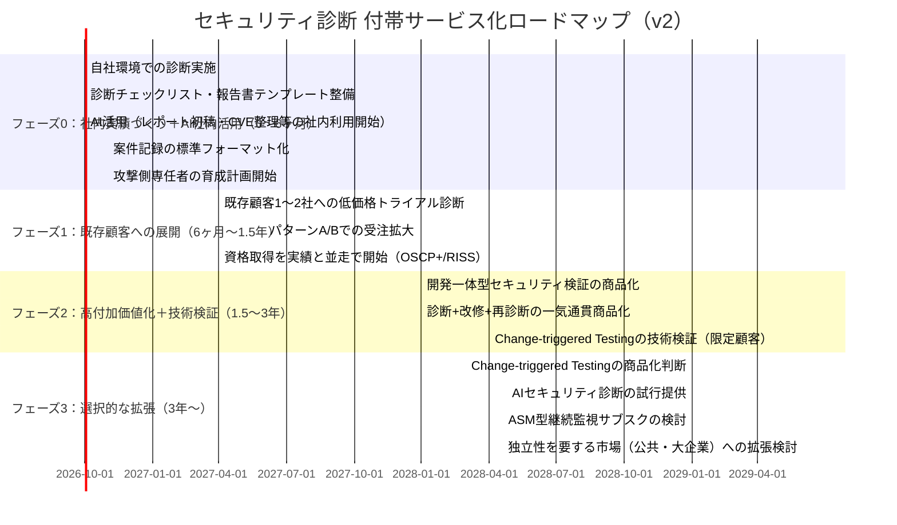

# セキュリティビジネス新規参入 事業計画書（改訂版 v2）
### 〜既存のセキュリティ関連受託開発（オンプレ／クラウド）を土台とした段階的参入モデル〜

**作成日**：2026年9月
**改訂内容**：初版（v1）に対する外部レビュー（アップロード資料）を検証し、妥当性のある指摘を反映。ただし、実装負荷を過小評価した提案は「将来の選択肢」として保留し、当面のスコープ拡大を抑制した。
**対象読者**：既存事業（セキュリティ関連受託型システム開発、オンプレ・クラウド両対応）を持つ経営層

---

## 0. サマリー：結論を先に

| 論点 | v1（初版） | v2（本改訂版） |
|---|---|---|
| 事業の位置づけ | 既存受託への付帯サービス | **維持** |
| 主軸商品 | クラウド設定診断 | Web/API・Cloud・IAMを一体化した「開発一体型セキュリティ検証」に呼称・範囲を精緻化 |
| AI活用の開始時期 | 3年目以降 | **0年目から社内利用を開始**（診断結果の分類・レポート初稿等、生産性向上目的に限定） |
| 資格・制度対応 | 実績を先に作り後追い | **記録の標準化は今から並走**（資格取得の前倒しは行わない） |
| 独立性の二層構造 | 想定していなかった | **将来の選択肢としてメモに留め、今は組織設計に組み込まない** |
| Change-triggered Testing | 3年目以降のASM構想 | 技術検証は2年目に前倒しするが、**商品化は3年目以降のまま** |
| CISSP | 重視 | **優先順位を下げる**（実行力のある人材確保を優先） |
| 新規営業 | 当面ゼロ | 「新規営業組織を作らない」という定義を維持しつつ、将来的な拡張余地（紹介・協業）を明記 |

**本改訂の基本姿勢**：外部レビューで指摘された事実（IPA「情報セキュリティ10大脅威2026」でAIリスクが組織向け3位に初ランクイン、公共調達における独立性要件の存在等）は正確であり、方向性の一部は前倒しする価値がある。しかし、これらを**同時に・一気に**取り込むと、既存の受託開発を本業としながら進める体制には荷が重すぎる。したがって、**低コストで着手できるものは前倒しし、実装負荷の高いものは「検証」に留め、組織構造に手を付けるものは「将来の選択肢」として保留する**、という優先順位付けを本改訂の核心とする。

---

## 1. 前提となる分析：調査レポート群とその再検証の評価

### 1-1. 元となった4本の調査レポート

1. **security-business-1.md**：セキュリティ市場全体の俯瞰、5領域の比較
2. **security-business-2.md**：脆弱性診断・ペネトレーションテストを8事業に分解した3フェーズ成長モデル
3. **security-business-3.md**：AI時代を前提にした事業モデルの再構築
4. **security-business-4.md**：AI転換後に必要な人材モデル・資格ロードマップ

### 1-2. v1（初版事業計画書）の骨子

- 独立事業ではなく、既存受託契約への付帯サービスとして参入
- 新規営業組織は当面作らず、既存顧客（パターンA）・既存SIer経由（パターンB）に限定
- 差別化は「作った会社が診断・改修まで一気通貫でできる」こと
- AI活用・ASM型サブスクは3年目以降の拡張オプション
- 資格取得は実績を先に作ってから後追い

### 1-3. 外部レビューによる再検証の内容と、その事実確認結果

外部レビューは、v1の「参入方法」（付帯サービス化、新規営業組織を作らない、既存エンジニア活用）は妥当としつつ、「将来の主力事業」と「AIの位置づけ」の修正を提案した。主な事実的根拠は以下の通りで、**いずれも確認の結果、正確**であった。

- **IPA「情報セキュリティ10大脅威2026」**：組織向け脅威の3位に「AIの利用をめぐるサイバーリスク」が初ランクイン（2026年1月29日発表）。4位は「システムの脆弱性を悪用した攻撃」で、従来型の脅威も引き続き上位。
- **公共調達における独立性要件**：J-LISは過去複数回（2019年、2021年、2023年等）の入札公告で、「対象システムの構築・運用を受託していない者であること」を参加資格として一貫して明記しており、これは一過性ではなく制度として定着したパターンである。

### 1-4. 再検証結果に対する再評価：採用する点と保留する点

外部レビューの提案を鵜呑みにせず、実装負荷の観点から精査した結果、以下のように仕分けした。

| 外部レビューの提案 | 事実的根拠 | 再評価 |
|---|---|---|
| AIを0年目から社内利用 | IPA脅威ランキングでAIリスクが3位 | **採用**：低コストで前倒し可能 |
| 資格・制度対応を「後追い」から「並走」へ | IPA適合サービスリスト、SCS評価制度の存在 | **採用**：記録の標準化はコストがほぼゼロ |
| CISSPの優先順位を下げる | 実行力人材の確保が先決という論理 | **採用** |
| 独立性を前提とした二層構造（開発一体型／独立第三者型）を今から設計 | J-LIS等の公共調達要件 | **保留**：御社の当面の顧客層（既存受託先）とは別市場。今の組織規模で分離体制を作るのは過大負荷 |
| Change-triggered Testing（CI/CD連動診断）を2年目から商品化 | ASM市場の飽和、既存製品の高度化 | **一部採用**：技術検証は2年目に前倒しするが、商品化は3年目以降に据え置く |
| クラウド診断単体から「開発・クラウド一体型」への呼称変更を「最大の修正点」とする | ー | **部分的に採用**：呼称・範囲の精緻化として反映するが、v1の一気通貫方針と実質的な矛盾はないため「大きな方向転換」としては扱わない |

---

## 2. 中核となる意思決定：どこで戦うか（v1から維持）

### 2-1. 「実力」と「強み」は両方必要（価格勝負を避ける条件）

| 状態 | 結果 |
|---|---|
| 実力はあるが強みがない | 競合と同じ結果しか出せない → 価格だけで比較される |
| 強みはあるが実力がない | 表面化しない品質不足が事故に直結し、信用を失う |
| **実力＋強みの両方** | **価格勝負を回避できる唯一の状態** |

### 2-2. 御社にとっての「強み」の正体（維持）

1. **説明可能性の強さ**：内部構造・設計判断の理由まで知っているため、「なぜこの設定か」「直すと何が壊れるか」まで含めて説明できる
2. **改修まで一気通貫**：診断専業者は「穴を見つける」までが商品。御社は「診断→改修→再診断」を1社で完結できる
3. **競合が土俵に上がらない領域**：新規開拓ではなく既存の受託関係に乗せる限り、価格比較の対象にすらならない

### 2-3. 避けるべき罠（維持・一部追記）

- 新規に営業組織を立ち上げて、新規顧客に「診断単体」を売り込む
- クラウド診断・スマホ診断を「技術的にできるから」という理由だけで主力商品化する
- AI活用をいきなり独立商品として掲げる
- **（追記）独立性が求められる将来市場（公共・大企業）に備えて、今の段階で組織を分離すること**（実際の引き合いが出るまで保留すべき）

---

## 3. 事業モデル：既存事業への「付帯サービス」としての設計（維持）

### 3-1. 新規事業ではなく付帯サービスと位置づける理由

受託開発は「向こうから仕事が来る」「決まった取引先から継続発注される」性質のビジネスであり、自ら新規顧客を開拓し単価と提案内容を主導する営業機能を通常持たない。したがって、セキュリティ診断を**独立した新規事業の柱**として立てるのではなく、**既存の受託契約に組み込む粗利改善策**として位置づける。

### 3-2. 3つの受注パターン（維持）

| パターン | 内容 | 主導権 | 新規営業の要否 |
|---|---|---|---|
| **A：既存顧客への追加提案** | 現在開発・保守中の顧客に「セキュリティ健康診断」を窓口担当から提案 | 自社 | 不要（既存関係の延長） |
| **B：元請けSIerの下請け** | 取引のある元請けから「診断部分だけ外注したい」という声に対応 | 相手方 | 不要（受け身で対応） |
| **C：新規営業による開拓** | 自社ブランドで新規顧客に売り込む | 自社 | **必要（当面非推奨）** |

**「初期は新規営業組織を作らない」と定義する。** 完全にゼロにするという意味ではなく、紹介・SIerパートナーシップ・協業といった形での自然な拡張は、フェーズが進んだ段階（4章参照）で許容する。

### 3-3. 成功指標（維持・一部追加）

- 既存受託案件の**単価・粗利の上昇率**
- 診断込み契約による**既存顧客の解約率低下**
- 診断実績を通じた**次期開発案件の受注率**
- **（追加）診断付帯率**：既存開発案件の何％に診断を付けられたか
- **（追加）改修転換率**：診断案件の何％が改修案件につながったか
- **（追加）AI生産性改善率**：1案件当たりの診断工数をAI導入によって何％削減できたか

---

## 4. フェーズ別ロードマップ（改訂）

### フェーズ0：社内実績づくり＋AI社内活用（0〜6ヶ月）

- 自社が構築したオンプレ／クラウド環境を対象に、社内で診断を実施し実務経験を積む
- チェックリスト（CIS Benchmarks、クラウドベストプラクティス等）と報告書テンプレートを整備
- **【改訂】AIを社内専用ツールとして導入**：診断結果の初期分類、重複Finding整理、CVE/CWE情報整理、レポート初稿作成など、顧客向け商品ではなく生産性向上のためだけに使う
- **【改訂】案件記録の標準フォーマット化を開始**：案件名・対象システム・実施者・手法・発見事項・顧客報告・再診断結果・QAレビューを、将来の資格・制度対応に備えて最初から記録する（資格取得自体は急がない）
- 攻撃側（Offensive）スキルを持つ担当者を最低1名選定し、育成を開始
- **投資規模の目安**：数十万〜200万円程度

### フェーズ1：既存顧客への展開（6ヶ月〜1.5年）

- 関係の深い既存顧客1〜2社に対し、低価格でのトライアル診断を実施
- パターンA（追加提案）・パターンB（下請け）での受注を広げる
- **【改訂】資格取得（OSCP+、RISSの取得検討）を実績作りと並走して開始**。ただし採用条件ではなく育成目標とする
- IPA適合サービスリスト掲載の検討はこの段階で情報収集を始めるが、申請自体はフェーズ2以降でよい

### フェーズ2：高付加価値化＋技術検証（1.5〜3年）

- Web/API・クラウド・IAMを一体化した「開発一体型セキュリティ検証」を正式商品化（呼称の精緻化。実質はv1の一気通貫方針の延長）
- 「診断→その場で改修→再診断」の一気通貫商品を前面に打ち出す
- **【改訂・限定的に前倒し】Change-triggered Testing（CI/CD連動での変更検知型診断）の技術検証を、既存顧客1〜2社限定で開始**。ただし、これは顧客ごとに異なるCI/CD基盤との連携開発を伴う工数の大きい取り組みであり、**商品化はフェーズ3に据え置く**（技術検証と商品化を明確に分離する）

### フェーズ3：選択的な拡張（3年〜）

- Change-triggered Testingの商品化を判断（フェーズ2の検証結果次第）
- AIセキュリティ診断（RAG・AIエージェント等を対象とした診断）を試行提供として開始
- 外部公開資産の継続監視（ASM型）をサブスクリプション商品として検討
- **【新設】独立性が求められる市場（公共案件、大企業の第三者保証案件）への拡張を検討**。ただし、これは具体的な引き合い・案件機会が実際に見えてきた段階で、診断チームと開発チームの体制分離を含めて設計する。**今の組織規模で先回りして二層構造を作ることはしない**

---

## 5. 比較表：3つの立場の整理（v1／外部レビュー／v2統合）

| 項目 | v1（初版） | 外部レビュー（アップロード資料） | v2（本改訂・統合結論） |
|---|---|---|---|
| 事業の位置づけ | 既存受託への付帯サービス | 維持を支持 | **維持** |
| 主軸商品 | クラウド設定診断 | 「開発・クラウド一体型セキュリティ検証」へ変更 | 呼称・範囲を精緻化して採用（実質はv1の延長） |
| AIの開始時期 | 3年目以降 | 0年目から内部利用、2年目から商品化 | **0年目から内部利用を採用**。商品化は3年目以降のまま据え置き（前倒しの根拠は「内部利用」の部分のみ支持） |
| ASM/Change-triggered Testing | 3年目以降 | 2年目から商品化 | 2年目は「技術検証」に留め、商品化は3年目以降（実装負荷を考慮し前倒し幅を圧縮） |
| 差別化 | 開発会社による診断・改修の一気通貫 | 開発一体型＋独立第三者型の二層モデル | 二層モデルは**将来の選択肢としてメモ**するが、今は組織に反映しない |
| 資格戦略 | 実績を先に作り後追い | 実績・資格・QA・制度対応を並走 | **記録の標準化のみ即座に並走**。資格取得自体はフェーズ1から開始（急がない） |
| CISSP | 重視せず | 優先順位を下げる（同意） | **維持（優先度低）** |
| 新規営業 | 当面ゼロ | 「初期は作らない」と定義し直し、将来拡張の余地を明記 | **採用**：当面はパターンA/Bのみ、将来的な紹介・協業は否定しない |

---

## 6. 商品比較表：フェーズ別の商品ポートフォリオ（改訂）

| フェーズ | 商品 | 価格帯目安 | 受注パターン | 必要な追加投資 |
|---|---|---|---|---|
| 0 | 社内診断（実績作り）＋AI社内活用 | ー（投資扱い） | 自社案件 | 検証環境・学習コスト・AIツール利用料 |
| 1 | セキュリティ健康診断（トライアル） | 20〜50万円 | A：既存顧客 | 報告書テンプレート整備 |
| 1〜2 | 開発一体型セキュリティ検証（Web/API/Cloud/IAM） | 50〜150万円 | A・B | 攻撃側専任者の育成 |
| 2 | 診断＋改修＋再診断（一気通貫） | 100〜300万円 | A・B | 特になし（既存開発力を活用） |
| 2（検証） | Change-triggered Testing（技術検証） | ー（投資扱い、限定顧客に無償〜低価格提供） | A（限定1〜2社） | CI/CD連携開発の工数 |
| 3 | Change-triggered Testing（商品化） | 月10〜30万円 | A・B | 検証結果次第で追加投資判断 |
| 3 | AIセキュリティ診断（試行） | 個別見積 | A（既存顧客のAI導入先） | AI Security知見の蓄積 |
| 3〜 | クラウドPentest等（高難度） | 150〜400万円 | A・B（実績確認後） | 専門人材の採用・OSCP等取得 |

※価格は事業計画上の想定レンジであり、市場価格を保証するものではない。

---

## 7. 法務・ガバナンス整備（維持）

新規事業化の前に、以下は必ず整備する。

1. **スコープ合意書（Rules of Engagement）の標準テンプレート化**：診断範囲、除外対象、実施時間帯、緊急停止条件を契約時に明文化
2. **サイバー賠償責任保険（E&O/Cyber Liability）への加入**：診断中の本番障害・情報漏洩に備える
3. **実攻撃検証時の承認フロー**：特に本番環境での検証は、顧客側の最終承認者を契約書レベルで固定化
4. **実績記録の保存体制**：案件・実施者・実施内容・対象環境・結果・顧客確認を記録し、将来の資格・制度登録に活用できる形で蓄積（フェーズ0から即時開始）

---

## 8. 人材計画：攻撃側スキルの追加教育（維持）

既存エンジニアは防御側（作る力）に強いが、診断には攻撃側（壊す力）の視点が別途必要。

| ステップ | 内容 |
|---|---|
| Step 1 | 既存エンジニア1〜2名を選定し、攻撃側基礎（OWASP Top 10、クラウド攻撃パターン、CIS Benchmarks）を学習 |
| Step 2 | OSCP等の資格取得を目標に設定するが、**採用条件ではなく育成目標**とする（フェーズ1から並走開始） |
| Step 3 | 社内実績が一定数貯まった段階で、RISS（登録セキスペ）取得者を1名確保し、対外的信用の裏付けとする |
| Step 4 | 外部の攻撃側専門人材（フリーランス・業務委託）との連携も並行して検討し、内製化を急ぎすぎない |
| Step 5（新設） | AI活用の設計・運用を担当できる人材（Python・LLM API等）を、既存エンジニアの中から1名兼任で育成し始める。専任化はフェーズ3以降 |

---

## 9. リスクと対応策（改訂）

| リスク | 対応策 |
|---|---|
| 価格競争に巻き込まれる | 新規開拓を避け、既存受託関係（パターンA/B）に限定して展開 |
| 技術力不足による品質事故 | 社内実績を積んでから対外提供を開始（フェーズ0を省略しない） |
| 攻撃側人材の採用難航 | 既存エンジニアの育成を優先、外部専門家との業務委託を併用 |
| AI技術進歩による陳腐化 | AIを独立商品化せず、当面は生産性ツールとしての限定利用に留める |
| 診断中の事故・法的リスク | RoE標準化、賠償責任保険加入、承認フローの契約書レベルでの明文化 |
| **（新設）スコープ拡大による本業への支障** | フェーズごとに「今すぐ着手」「検証に留める」「まだ着手しない」を明確に切り分け、既存の受託開発本業を圧迫しない範囲で進める |
| **（新設）二層構造の先行構築による過剰投資** | 独立性を要する市場（公共・大企業）への対応は、具体的な引き合いが出てから組織設計に着手する。事前の投機的な体制分離は行わない |

---

## 10. 次のアクション（提案）

1. 既存受託顧客のうち、関係が深く技術的に協力を得やすい1〜2社をリストアップする
2. 社内でのパイロット診断（フェーズ0）の実施スケジュールを確定する
3. AI活用（レポート初稿・CVE整理等）を社内ツールとして試験導入する
4. 案件記録の標準フォーマットを設計し、フェーズ0の時点から運用を開始する
5. 攻撃側スキルを育成する担当者を指名し、学習計画を立てる
6. スコープ合意書・保険加入など、法務面の整備を並行して進める
7. Change-triggered Testingや独立性を要する市場への拡張は、**具体的な機会が見えるまで意思決定を保留し、リソースを分散させない**

---

*本計画書は、提供された4本の調査レポート（security-business-1〜4.md）、初版事業計画書、および外部レビュー資料（cl2cg-security-business-1.md）を踏まえ、事実確認の結果とリソース制約の両面から再統合したものである。数値・価格帯はいずれも検討用の仮定であり、実際の市場価格や受注可能性を保証するものではない。*
